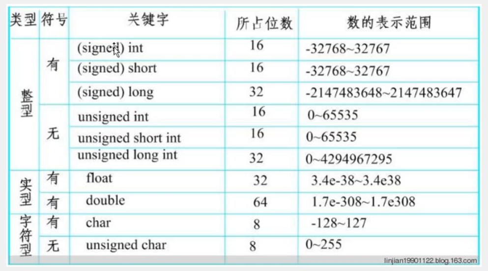
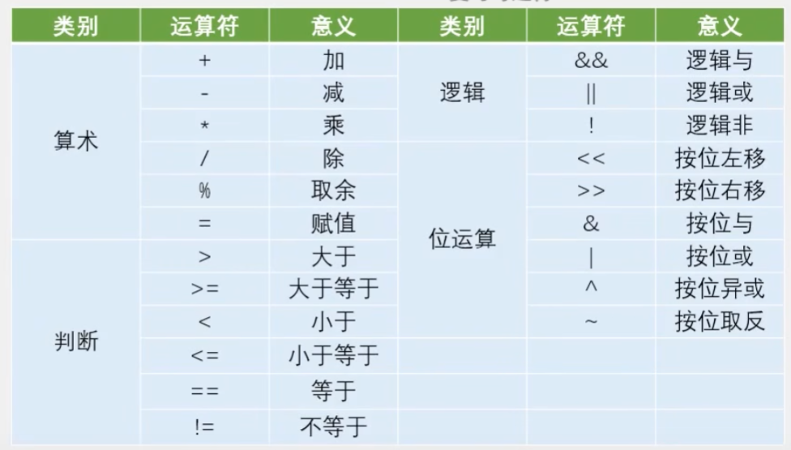

# 江协科技 C51 学习记录
## 普中A2 C51开发板介绍
1. CPU/MCU STM89C52 最小芯片 单片机 （40引脚）             USB直接下载程序，flash rom
2. CPU/MCU晶振 11.0592MHz
3. D1~D8 LED灯
4. K1~K4 独立按键
5. S1~S16 矩阵按键
6. IR1 红外传感器                 遥控器
7. AT                            多根线下载程序
8. 无线模块 2.4G 无遥控器
9. USB口 下载程序
10. DS1302 实时时钟芯片            可定时控制或者闹钟
11. 时钟晶振（金属柱状晶振）
12. 复位按钮
13. AD/DA 模数转换器
14. GR1 光敏电阻
15. NTC1 热敏电阻
16. 电位器--滑动变阻器
17. 74HC595 芯片                    扩展IO口
18. 步进电机/直流电机                工业控制领域，精确控制角度
19. 蜂鸣器
20. 超声波接口                       外接测距
21. 74HC138 芯片                    译码器,扩展IO口，驱动数码管
22. 24C02 芯片                      EEPROM 掉电不丢失
23. 18B20 芯片                      I2C 模块，温度传感器
24. 74HC245 芯片                    驱动数码管
25. 排座  插液晶屏LCD1602/LCD12864   可用电位器调对比度
26. 点阵屏  16*16 LED矩阵
27. 电源开关
28. 五线四相步进电机

## 元件数据标注规定
102 = 10 00         1K
473 = 47*10^3       47K
**数字过大情况**
1002 = 100*10^2     10K

## 十六进制转换表
| 十进制 | 二进制 | 十六进制 | 十进制 | 二进制 | 十六进制 |
|--------|--------|----------|--------|--------|----------|
| 0      | 0000   | 0        | 8      | 1000   | 8        |
| 1      | 0001   | 1        | 9      | 1001   | 9        |
| 2      | 0010   | 2        | 10     | 1010   | A        |
| 3      | 0011   | 3        | 11     | 1011   | B        |
| 4      | 0100   | 4        | 12     | 1100   | C        |
| 5      | 0101   | 5        | 13     | 1101   | D        |
| 6      | 0110   | 6        | 14     | 1110   | E        |
| 7      | 0111   | 7        | 15     | 1111   | F        |

## 编写程序

### 创建工程
1. 打开 Keil uVision 软件
2. 点击 `Project` -> `New Project`,自行保存项目位置和名称
3. 在弹出的`select device for target`对话框中，选择芯片厂家`Atmel`->`AT89C52`
4. 自行选择是否需要启动文件`START`

### 添加源文件
1. 在生成的项目目录结构里，在`Source Group 1`下添加源文件`Add New Item to Group`
2. 在弹出的对话框中,自行选择编辑语言，建议选择 `C Source File`

### 编译
1. 编译常用按钮在左上角，依次为`translate`、`build`、`rebuild`，一般使用 `Build`按钮编译软件
2. 编译前根据需要点击 `options for target` -> `output` -> `create hex file`
3. 编写代码时可`configuration` -> `font`更改显示字体
4. 添加头文件可以右键`insert #include<・・・>`，想查看此文件内容就右键`open document <・・・>`

### 烧写
1. USB连接开发板，打开Ai-Cube-ISP软件
2. 选择芯片型号和扫描串口
3. 点击 `打开程序文件` -> 选择之前生成的 `hex` 文件
4. 点击 `下载` 按钮，打开开发板开关上电
5. 观察日志输出，检查LED灯的亮灭

**注意**
- `Atmel` 2016年就被 Microchip 收购了，现在新的 Keil 里 AT89C51 系列都在 `Microchip`目录下。
- 可能存在开发板引脚复用导致的引脚冲突，具体表现为其他模块可能也会亮起
- 若烧录软件日志一直显示`正在监测目标单片机`，请检查开发板型号是否选择正确

## 串口调试工具
1. 打开 `Ai-Cube-ISP` 软件
2. 选择 `Tools` -> `软件延时计算器`
3. 根据开发板晶振频率选择 `11.0592MHz` 的系统频率
4. 选择`定时时间`为`500ms`，`8051指令集`选择对应开发板系列硬件的指令集，这里选择`STC89`
5. 复制生成的delay延时代码

## C51数据类型

## C51数据运算

### 常用位运算符
1. 按位左移运算：`<<`
   - 运算规则：将二进制数向左移动一位，最高位丢弃，最低位补0
   - 例如：1100 0001 << 1 = 1000 0010
 - 
2. 按位右移运算：`>>`
   - 运算规则：将二进制数向右移动一位，最低位丢弃，最高位补0
   - 例如：0010 0011 >> 1 = 0001 0001
  
3. **按位与**运算：`&`
   - 运算规则：将两个二进制数按位与，**相同为1，否则为0**
   - 例如：0010 0011 & 1100 0001 = 0000 0001  
    
4. **按位或**运算：`|`
   - 运算规则：将两个二进制数按位或，有一个为1，就为1
   - 例如：0010 0011 | 1100 0001 = 1110 0011
  
5. **按位异或**运算：`^`
   - 运算规则：将两个二进制数按位异或，**相同为0，不同为1**
   - 例如：0010 0011 ^ 1100 0001 = 1110 0010
  
6. **按位非**运算：`~`
   - 运算规则：将二进制数按位取反，0变1，1变0
   - 例如：~0010 0011 = 1101 1100
  

## 单片机电平有效状态
本实验采用开发板为低电平有效，低电平点亮LED灯。

单片机“弱上拉，强下拉”，P1,P2,P3都是弱上拉工作模式，即低电平对电路影响更大

### 单片机引脚并不是“默认高电平有效”。
**“有效”这个概念完全取决于外部电路的连接方式，而不是单片机本身**。单片机引脚本身只是一个可以输出高电平（通常接近VCC，如5V或3.3V）或低电平（接近0V）的端口，或者可以读取外部输入电平状态的接口。

#### 引脚默认状态（上电状态）
首先，要区分“默认电平”和“有效电平”。

1. 默认电平（上电状态）：指单片机刚通电、尚未被程序初始化时，引脚的 electrical state（电气状态）。

>对于大多数51系列单片机（如STC89C52），P0口是高阻态（既不是高电平也不是低电平，状态不确定），而 P1, P2, P3口 通常是弱上拉（Weak Pull-up）状态，可以理解为默认被内部电阻拉成了一个不稳定的高电平。所以严格来说，51单片机的多数IO口上电后有一个趋向于高电平的默认状态，但这并不代表“高电平有效”。

2. “有效电平”由电路设计决定
“有效”指的是“让某个外部设备（如LED、继电器、蜂鸣器）开始工作”的电平。

**核心原则**：**电流从单片机流向地（GND）最容易驱动设备**。

#### 我们来看两个最经典的例子：

##### **案例一：控制LED（低电平有效更常见）**
1. **电路A（低电平有效 `Low-Active`）：**
**VCC -> 电阻 -> LED -> 单片机引脚**

   - 程序输出 0（低电平）：LED两端形成电压差（VCC到GND），电流通过，LED点亮。此时低电平是“有效”电平
   - 程序输出 1（高电平）：LED两端电位几乎相等（都是VCC），没有电流，LED熄灭。此时高电平是“无效”电平。

结论：在这个电路中，是低电平有效。

2. **电路B（高电平有效 `High-Active`）：**
**单片机引脚 -> 电阻 -> LED -> GND**

   - 程序输出 1（高电平）：单片机引脚提供VCC，电流从引脚流出经过LED到地，LED点亮。此时高电平是“有效”电平。
   - 程序输出 0（低电平）：无法提供电流，LED熄灭。此时低电平是“无效”电平。

结论：在这个电路中，是高电平有效。

3. 为什么电路A（低电平有效）更常用？
因为51系列单片机的**拉电流**（输出高电平时提供电流）能力很弱（约几十uA），而**灌电流**（输出低电平时吸收电流）能力较强（约几个mA）。用电路A（**低电平有效）可以更明亮地驱动LED**。现代单片机的驱动能力已大大增强，但这种设计习惯保留了下来。

##### **案例二：读取按键（低电平有效更常见）**
1. **电路A（低电平有效）：**
**单片机引脚 -> 上拉电阻 -> VCC**
按键 -> 连接在引脚和GND之间

   - 按键未按下：引脚被上拉电阻拉到VCC，程序读到 1。
   - 按键按下：引脚直接连接到GND，程序读到 0。

结论：在这个标准电路中，按键按下时产生低电平，所以是低电平有效。

2. **电路B（高电平有效）：**
**单片机引脚 -> 下拉电阻 -> GND**
按键 -> 连接在引脚和VCC之间

这种接法较少见，因为不符合常规思维。

#### **总结**
1. 没有默认有效电平：“有效”电平是电路工程师根据硬件特性（如驱动能力、功耗、安全）设计电路时决定的，不是单片机固有的。

2. 低电平有效更常见：由于历史原因（驱动能力）和电路设计习惯，在51单片机项目中，LED、按键、蜂鸣器等外设常用低电平作为有效控制电平。

3. 编程中，是让引脚输出高电平还是低电平来控制设备，完全取决于你的硬件电路是怎么连接的。 永远以原理图为准。
>**如果LED的一端接在VCC，那么控制脚输出低电平（0）时灯才亮，这就是低电平有效。**
>**如果LED的一端接在GND，那么控制脚输出高电平（1）时灯才亮，这就是高电平有效。**

## 定时器和中断

[定时器和中断原理](<experiments/7-1 定时器/readme.md>)

本质是对各个相关的寄存器进行操作，设置相关工作模式

定时器寄存器初值的设置：
**初值 = 65536 - （ 定时时间 * 晶振频率 / 12 ）**
>例如
寄存器为8位寄存器，共TH和TL两个8位寄存器，则有0~65535
每隔1us计数加一，总定时为65535us
**65545**离计数溢出差值为1000，则计时时间为1ms
