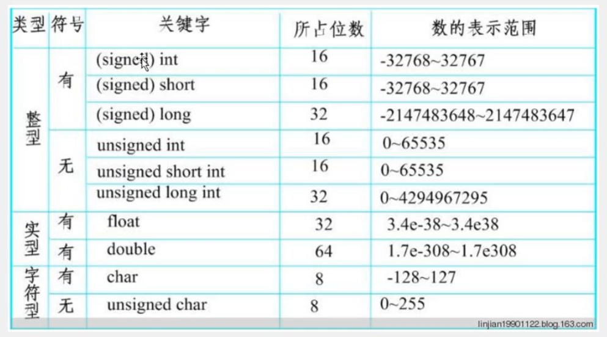

# 江协科技 C51 学习记录
## 普中A2 C51开发板介绍
1. CPU/MCU STM89C52 最小芯片 单片机 （40引脚）             USB直接下载程序，flash rom
2. CPU/MCU晶振 11.0592MHz
3. D1~D8 LED灯
4. K1~K4 独立按键
5. S1~S16 矩阵按键
6. IR1 红外传感器                 遥控器
7. AT                            多根线下载程序
8. 无线模块 2.4G 无遥控器
9. USB口 下载程序
10. DS1302 实时时钟芯片            可定时控制或者闹钟
11. 时钟晶振（金属柱状晶振）
12. 复位按钮
13. AD/DA 模数转换器
14. GR1 光敏电阻
15. NTC1 热敏电阻
16. 电位器--滑动变阻器
17. 74HC595 芯片                    扩展IO口
18. 步进电机/直流电机                工业控制领域，精确控制角度
19. 蜂鸣器
20. 超声波接口                       外接测距
21. 74HC138 芯片                    译码器,扩展IO口，驱动数码管
22. 24C02 芯片                      EEPROM 掉电不丢失
23. 18B20 芯片                      I2C 模块，温度传感器
24. 74HC245 芯片                    驱动数码管
25. 排座  插液晶屏LCD1602/LCD12864   可用电位器调对比度
26. 点阵屏  16*16 LED矩阵
27. 电源开关
28. 五线四相步进电机

## 元件数据标注规定
102 = 10 00         1K
473 = 47*10^3       47K
**数字过大情况**
1002 = 100*10^2     10K

## 十六进制转换表
| 十进制 | 二进制 | 十六进制 | 十进制 | 二进制 | 十六进制 |
|--------|--------|----------|--------|--------|----------|
| 0      | 0000   | 0        | 8      | 1000   | 8        |
| 1      | 0001   | 1        | 9      | 1001   | 9        |
| 2      | 0010   | 2        | 10     | 1010   | A        |
| 3      | 0011   | 3        | 11     | 1011   | B        |
| 4      | 0100   | 4        | 12     | 1100   | C        |
| 5      | 0101   | 5        | 13     | 1101   | D        |
| 6      | 0110   | 6        | 14     | 1110   | E        |
| 7      | 0111   | 7        | 15     | 1111   | F        |

## 编写程序

### 创建工程
1. 打开 Keil uVision 软件
2. 点击 `Project` -> `New Project`,自行保存项目位置和名称
3. 在弹出的`select device for target`对话框中，选择芯片厂家`Atmel`->`AT89C52`
4. 自行选择是否需要启动文件`START`

### 添加源文件
1. 在生成的项目目录结构里，在`Source Group 1`下添加源文件`Add New Item to Group`
2. 在弹出的对话框中,自行选择编辑语言，建议选择 `C Source File`

### 编译
1. 编译常用按钮在左上角，依次为`translate`、`build`、`rebuild`，一般使用 `Build`按钮编译软件
2. 编译前根据需要点击 `options for target` -> `output` -> `create hex file`
3. 编写代码时可`configuration` -> `font`更改显示字体
4. 添加头文件可以右键`insert #include<・・・>`，想查看此文件内容就右键`open document <・・・>`

### 烧写
1. USB连接开发板，打开Ai-Cube-ISP软件
2. 选择芯片型号和扫描串口
3. 点击 `打开程序文件` -> 选择之前生成的 `hex` 文件
4. 点击 `下载` 按钮，打开开发板开关上电
5. 观察日志输出，检查LED灯的亮灭

**注意**
- `Atmel` 2016年就被 Microchip 收购了，现在新的 Keil 里 AT89C51 系列都在 `Microchip`目录下。
- 可能存在开发板引脚复用导致的引脚冲突，具体表现为其他模块可能也会亮起
- 若烧录软件日志一直显示`正在监测目标单片机`，请检查开发板型号是否选择正确

## 串口调试工具
1. 打开 `Ai-Cube-ISP` 软件
2. 选择 `Tools` -> `软件延时计算器`
3. 根据开发板晶振频率选择 `11.0592MHz` 的系统频率
4. 选择`定时时间`为`500ms`，`8051指令集`选择对应开发板系列硬件的指令集，这里选择`STC89`
5. 复制生成的delay延时代码

## C51数据类型

