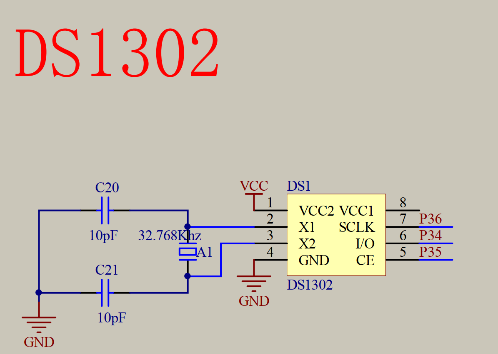
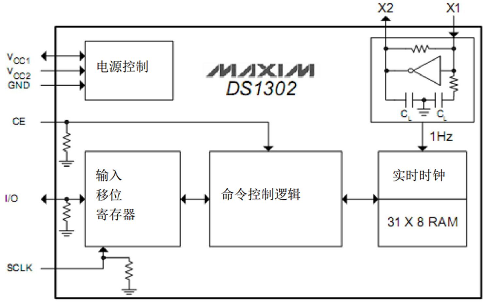
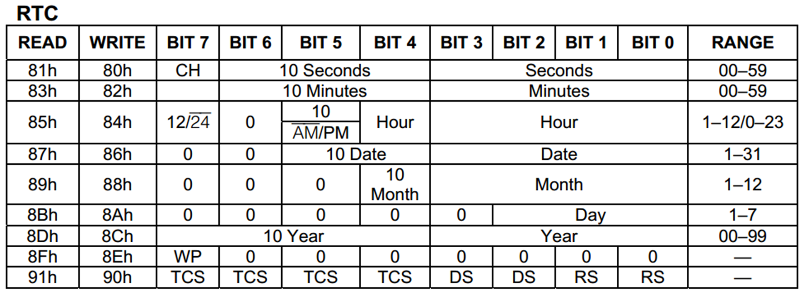
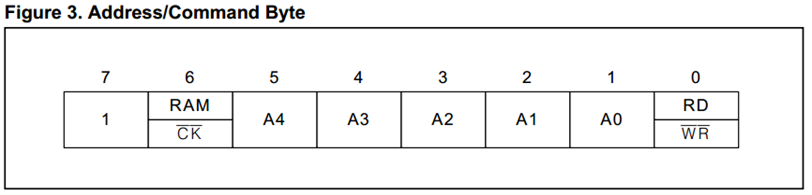
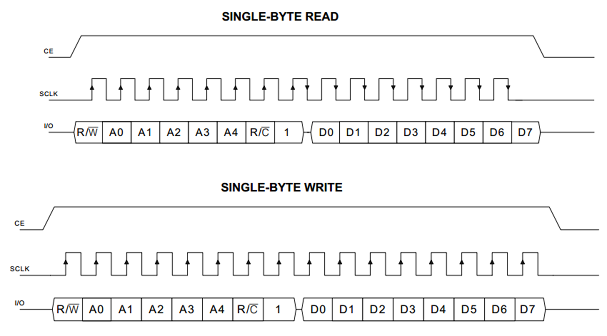

## DS1302 实时时钟
1. DS1302是由美国DALLAS公司推出的具有涓细电流充电能力的低功耗实时时钟芯片。它可以对年、月、日、周、时、分、秒进行计时，且具有闰年补偿等多种功能
2. **RTC(Real Time Clock)**：实时时钟，是一种集成电路，通常称为时钟芯片，DS1302就是一种实时时钟芯片，自带晶振，跟单片机晶振可能不同

### 单片机定时器时钟对比
1. 定时器时钟没有时钟芯片精度高
2. 占用单片机CPU处理时间
3. 无法断电，掉电丢失

### 原理图

### 引脚定义

|引脚名|作用|引脚名|作用|
|:---:|:---:|:---:|:---:|
|VCC2|主电源|CE|芯片使能|
|VCC1|备用电池|IO|数据输入/输出|
|GND|电源地|SCLK|串行时钟|
|X1、X2|32.768KHz晶振|||

一般实时时钟都是32.768KHz晶振（石英晶体振荡器），比较精确

内部寄存器针对时分秒进行存储，使用时需要从中读出数据

### 相关寄存器

**命令字**

### RTC时序图 

此时序图与**SPI**协议相似：时钟上升沿写入数据，下降沿读出数据

**SCLK**:单片机上升沿向时钟芯片写入数据，下降沿从时钟芯片读出数据
**第一字节**：命令字，低位在前，类似栈的原理
**第二字节**：数据，低位在前，类似栈的原理

#### **写操作**
1. CE上拉，使能
2. SCLK上拉，单片机发送一位数据给时钟芯片
3. SCLK下拉，单片机发送一位数据结束
4. SCLK循环此步骤发送完命令字，说明是读操作还是写操作
5. 继续此步骤发送数据，根据第一字节的命令字来操作数据，读或者写
**关闭写保护**DS1302有一个控制寄存器（地址0x8E写，0x8F读），其中最高位（BIT7）是写保护位。**要写入时间寄存器，必须先清除写保护位（即向0x8E写入0x00）**。

#### **读操作**
与写不同的是第一字节发送完成，立即释放IO口，给出一个下降沿，然后在下降沿进行数据的读取操作，每给一个下降沿即读出一位数
