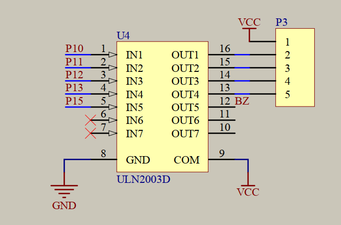

## 蜂鸣器
- 蜂鸣器是一种将**电信号转换为声音信号**的器件，常用来产生设备的按键音、报警音等提示信号
- 蜂鸣器按驱动方式可分为有源蜂鸣器和无源蜂鸣器
  - **有源蜂鸣器**：**内部自带振荡源**，将正负极**接上直流电压即可持续发声**，频率固定
  - **无源蜂鸣器**：内部不带振荡源，**需要控制器提供振荡脉冲**才可发声，调整提供振荡脉冲的频率，可发出不同频率的声音

### 原理图

#### **三极管驱动**

1. **NPN 三极管（低端开关）**
接法：蜂鸣器一端接 VCC，另一端接 NPN 集电极，发射极接地。
MCU 给 基极高电平 → 三极管导通 → 蜂鸣器与地相连 → 响。
**特点**：
   - 触发逻辑是 高电平有效。
   - 常用，电路简单，适合绝大多数单片机 IO 驱动。

2. **PNP 三极管（高端开关）**
接法：蜂鸣器一端接 PNP 发射极（VCC），另一端接 集电极，再接地。
MCU 给 基极低电平 → 三极管导通 → 蜂鸣器与 VCC 相连 → 响。

**特点**：
   - 触发逻辑是 低电平有效。
   - 常用于需要高端控制的场合，但单片机 IO 电平要能拉低到接近地。

**总结**：
   - NPN 用作低端开关，给高电平蜂鸣器响。
   - PNP 用作高端开关，给低电平蜂鸣器响。
   - 实际上多数人习惯用 NPN，因为 MCU 驱动方便，电路简单。

#### **芯片驱动**
单片机IO口不能直接驱动蜂鸣器，使用芯片**ULN2003**驱动，ULN2003一般用于电机驱动
**ULN2003**达林顿晶体管阵列，具体查看相关数据手册[doc\ULN2003中文手册.pdf](../../doc/ULN2003中文手册.pdf)

### 乐理_模拟谱子
**要素：音高，时长**

#### 音名与简谱对应

基本音名（国际记谱法）C D E F G A B
对应中文：do re mi fa sol la si
简谱数字表示1 2 3 4 5 6 7 = C D E F G A B
**0 表示休止符（无声）**

#### 音符高低表示

简谱常用符号：

低音: $\dot{1}, \dot{2}, \dot{3}$ ...
中音: $1, 2, 3 $...
高音: $\overset{\cdot}{1}, \overset{\cdot}{2}, \overset{\cdot}{3}$ ...

示例：
$ \dot{1}\ \dot{2}\ \dot{3}\ 1\ 2\ 3\ \overset{\cdot}{1}\ \overset{\cdot}{2} $

#### 音符时值

全音符 ? （4 拍）                 2s
二分音符 ? （2 拍）               1s
四分音符 ? （1 拍，常用）         500ms
八分音符 ? （1/2 拍）            250ms
十六分音符 ? （1/4 拍）          125ms

#### 拍号与节奏

常见拍号：
4/4：每小节 4 拍（最常见）
3/4：每小节 3 拍（圆舞曲风格）
2/4：进行曲

小节分隔：用 | 表示
例如：1 1 5 5 | 6 6 5 - |

#### 常用符号（四分音符为例子）：
**・**  表示音高变化（上下点区分高低八度。上为升高8度，下为降低8度）
**#**  表示升半音
**0**  表示休止，一般用于占位时间
**5 - -**  表示延长（如 2 拍的 5）             **500ms*3**
$ 1_{・} $ 附点表示在原有音长基础上再延长一半时长    **500ms+250ms**
$ 1 \ \underline{1}  \underline{2} \ 1 \ 1 $ 下划线表示半长，分别为  **500ms 250ms+250ms 500ms 500ms**

为了识谱方便，还会有延音线等其他符号

#### 蜂鸣器频率对照表（C 大调常用）

编写程序可以用数据计算出对应音符：
1. 机器周期=12*时钟周期，时钟周期为晶振频率的倒数
2. 一个周期翻转两次，所以计算多长时间翻转一次需要在周期上/2
3. 计算定时器初始值65536-周期/2
4. 晶振11.0592输入 =ROUND(65536-T/2 /(12/11.0592),0)
