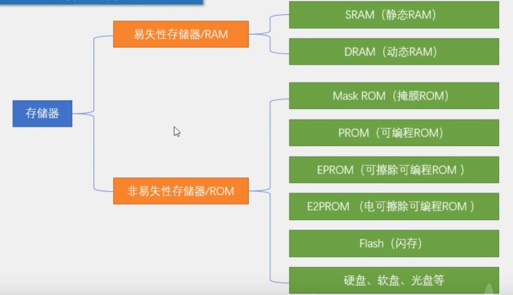
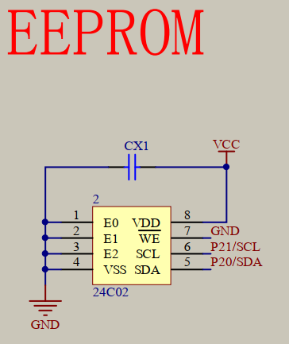
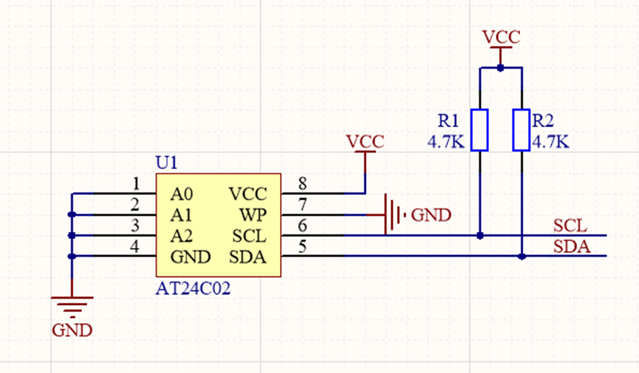
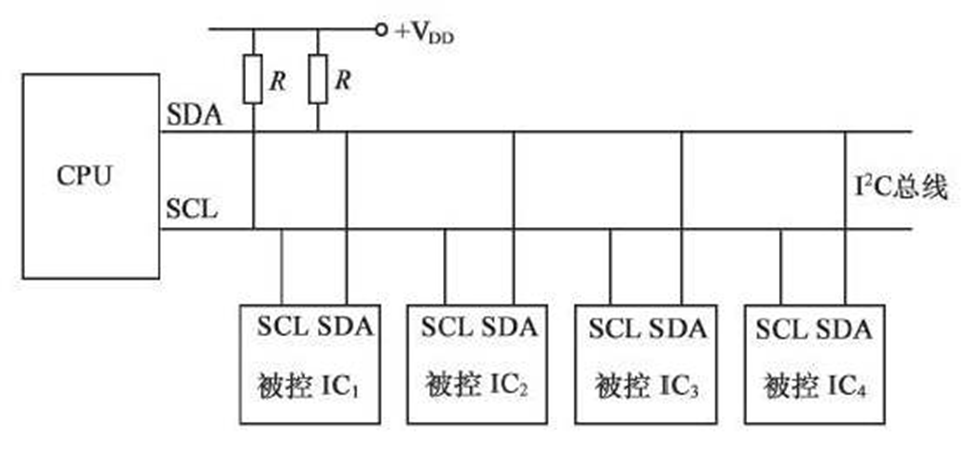
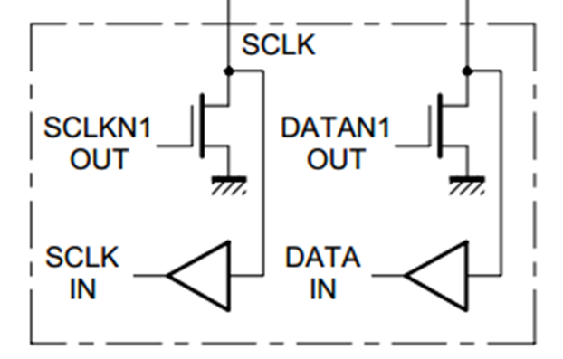
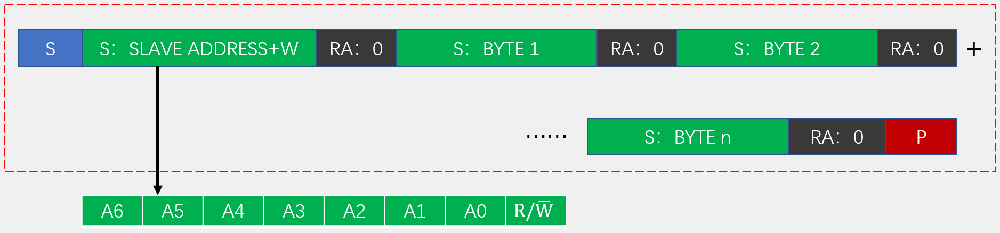
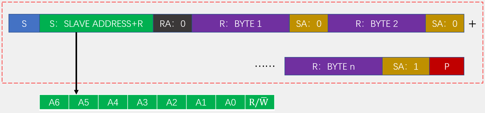
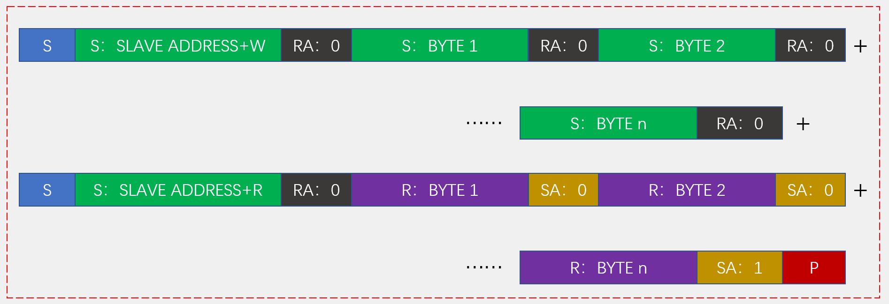
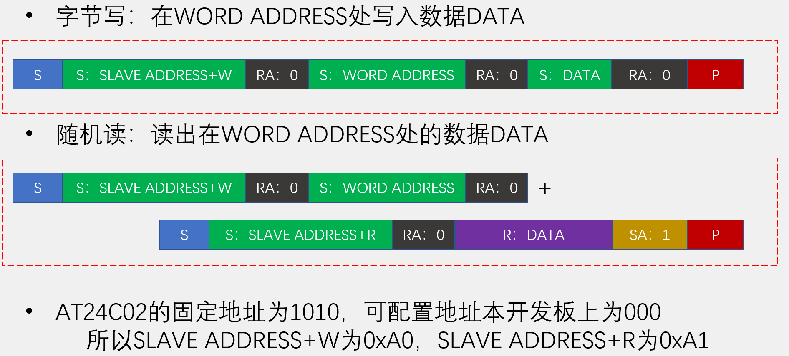

## AT24C02数据存储(I2C总线)
- AT24C02是一种可以实现掉电不丢失的存储器，可用于保存单片机运行时想要永久保存的数据信息
- 存储介质：E2PROM
- 通讯接口：I2C总线
- 容量：256字节

### 1. 存储器介绍
RAM存储器存储速度块，但容易掉电丢失
ROM存储器存储速度慢，但不会丢失数据
AT24C02是256字节的EEPROM，可以存储数据，也可以读取数据。

### 2. AT24C02本身是E2PROM

| 引脚        | 功能                 |
|-------------|----------------------|
| VCC、GND    | 电源（1.8V~5.5V）    |
| WP          | 写保护（高电平有效）  |
| SCL、SDA    | I2C接口              |
| A0、A1、A2  | I2C地址              |

## I2C总线
- I2C总线（Inter IC BUS）是由Philips公司开发的一种通用数据总线
- 两根通信线：SCL（Serial Clock）、SDA（Serial Data）
- 同步、半双工，带数据应答
- 通用的I2C总线，可以使各种设备的通信标准统一，对于厂家来说，使用成熟的方案可以缩短芯片设计周期、提高稳定性，对于应用者来说，使用通用的通信协议可以避免学习各种各样的自定义协议，降低了学习和应用的难度

### 电路规范
- 所有I2C设备的SCL连在一起，SDA连在一起
- 设备的SCL和SDA均要配置成开漏输出模式
- SCL和SDA各添加一个上拉电阻，阻值一般为4.7KΩ左右
- 开漏输出和上拉电阻的共同作用实现了“线与”的功能，此设计主要是为了解决多机通信互相干扰的问题

### 时序结构

**两线制**：仅使用两根线――SDA（串行数据线） 和 SCL（串行时钟线）。
**主从模式**：通信由主设备（Master） 发起并控制时钟，从设备（Slave） 响应。
**地址寻址**：每个从设备都有一个唯一的地址，主设备通过发送地址来选择与哪个从设备通信。
**开漏输出**：总线采用开漏（Open-Drain） 结构，必须通过上拉电阻连接到正电源。这意味着任何设备都可以将线路拉低（输出0），但释放后由电阻拉高（输出1）。这使得支持多主设备和时钟同步成为可能。

#### 时序单元分解(六个结构部分)

1. 起始条件 (Start Condition)和停止条件 (Stop Condition)
**起始条件 (S)**：在 SCL 为高电平期间，SDA 线发生从高到低的跳变。表示一次传输的开始。
**停止条件 (P)**：在 SCL 为高电平期间，SDA 线发生从低到高的跳变。表示一次传输的结束。

    |条件	|SCL 状态	|SDA 跳变	|含义|
    |:----:|:----:|:----:|:----:|
    |起始 (S)|	高电平	|高 → 低	|开始通信|
    |停止 (P)|	高电平	|低 → 高	|结束通信|

2. 数据传输 (Data Transfer)
**发送一个字节（Send）**：SCL低电平期间，主机将数据位依次放到SDA线上（高位在前），然后拉高SCL，从机将在SCL高电平期间读取数据位，所以SCL高电平期间SDA不允许有数据变化，依次循环上述过程8次，即可发送一个字节
**接收一个字节（Receive）**：SCL低电平期间，从机将数据位依次放到SDA线上（高位在前），然后拉高SCL，主机将在SCL高电平期间读取数据位，所以SCL高电平期间SDA不允许有数据变化，依次循环上述过程8次，即可接收一个字节（主机在接收之前，需要释放SDA）

3. 应答信号 (ACK) 与非应答信号 (NACK)
每传输完一个字节（8位数据）后，接收方必须发送一个应答位。
应答 (ACK)：发送方释放 SDA 线后，在第9个时钟脉冲期间，接收方将 SDA 线拉低，表示成功接收数据。
非应答 (NACK)：在第9个时钟脉冲期间，接收方不拉低 SDA 线（保持高电平），通常表示：
      - 接收失败或无法接收更多数据。
      - 主设备发送停止信号前的最后一个字节。
      - 读操作时，主设备告诉从设备传输结束。
**发送应答**（Send ACK）：在接收完一个字节之后，主机在下一个时钟发送一位数据，数据0表示应答，数据1表示非应答
**接收应答**（Receive ACK）：在发送完一个字节之后，主机在下一个时钟接收一位数据，判断从机是否应答，数据0表示应答，数据1表示非应答（主机在接收之前，需要释放SDA）

#### **完整数据传输流程**
一次典型的 I2C 通信序列如下：
**起始条件 (S)**：主设备发出起始信号。
**发送从设备地址** (7bit + R/W#)：主设备发送7位从设备地址和1位读写控制位（0 表示写，1 表示读）。
**应答 (ACK)**：对应地址的从设备拉低 SDA 线作为应答。
**数据传输**：
写操作：主设备逐个字节发送数据，每字节后从设备回应 ACK。
读操作：从设备逐个字节发送数据，每字节后主设备回应 ACK（最后一个字节回应 NACK）。
**停止条件 (P)**：主设备发出停止信号，结束通信。

### I2C数据帧
1. **发送一帧数据**：向谁发什么

2. **接收一帧数据**：向谁收什么

1. **先发送再接收数据帧（复合格式）**：向谁收指定的什么

1. **AT24C02数据帧**

