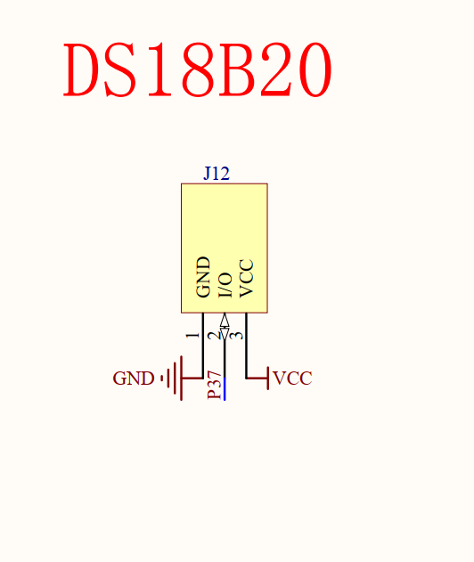
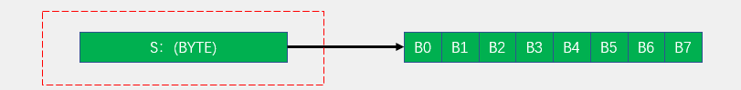
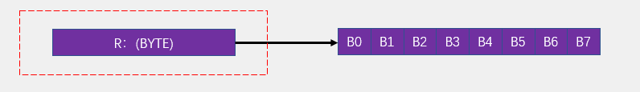
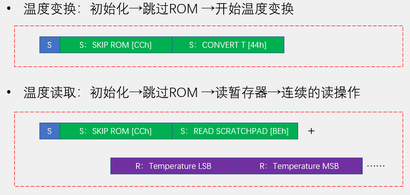
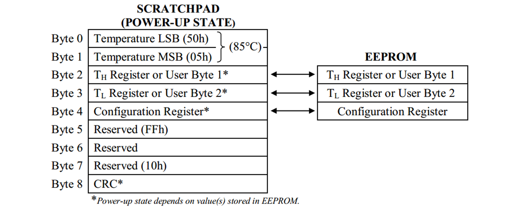
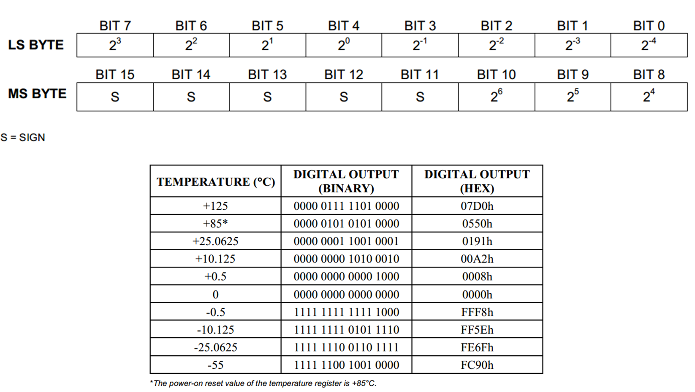

## DS18B20温度传感器
- DS18B20是一种常见的数字温度传感器，其控制命令和数据都是以数字信号的方式输入输-出，相比较于模拟温度传感器，具有功能强大、硬件简单、易扩展、抗干扰性强等特点
- 测温范围：-55°C 到 +125°C
- 通信接口：1-Wire（单总线）
- 其它特征：可形成总线结构、内置温度报警功能、可寄生供电
>DS：表示达拉斯公司，后被美信收购

### 硬件连接

|引脚名称|功能|
|--|--|
|VDD|+3.3V或+5V|
|GND|电源接地|
|DQ|数据引脚|

### 1-Wire（单总线）
- 单总线（1-Wire BUS）是由Dallas公司开发的一种通用数据总线
- 一根通信线：DQ
- 异步、半双工
- 单总线只需要一根通信线即可实现数据的双向传输，当采用寄生供电时，还可以省去设备的VDD线路，此时，供电加通信只需要DQ和GND两根线

#### 时序结构
**发送一位**：主机将总线拉低60~120us，然后释放总线，表示发送0；主机将总线拉低1~15us，然后释放总线，表示发送1。从机将在总线拉低30us后（典型值）读取电平，整个时间片应大于60us
**接收一位**：主机将总线拉低1~15us，然后释放总线，并在拉低后15us内读取总线电平（尽量贴近15us的末尾），读取为低电平则为接收0，读取为高电平则为接收1 ，整个时间片应大于60us

1. **发送一个字节**：连续调用8次发送一位的时序，依次发送一个字节的8位（低位在前）

2. **接收一个字节**：连续调用8次接收一位的时序，依次接收一个字节的8位（低位在前）

3. **DS18B20数据帧**
读写操作的执行者都是主设备

### DS18B20操作流程
- 初始化：从机复位，主机判断从机是否响应
- ROM操作：ROM指令+本指令需要的读写操作
- 功能操作：功能指令+本指令需要的读写操作

- 高八位和低八位共同组成一个温度值
- 高八位的前5位是符号位,`0为正，1为负`，低八位的后4位为温度值的小数部分，`0.5  0.25  0.125  0.0625`

此处涉及到反码补码等