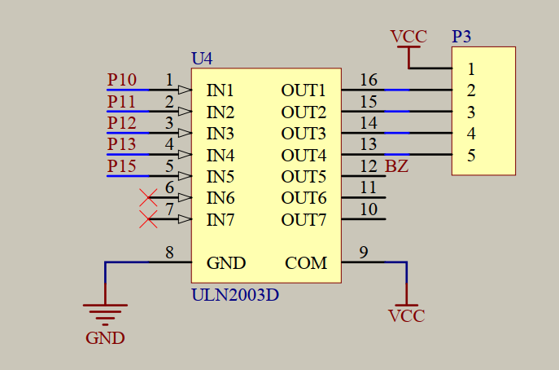
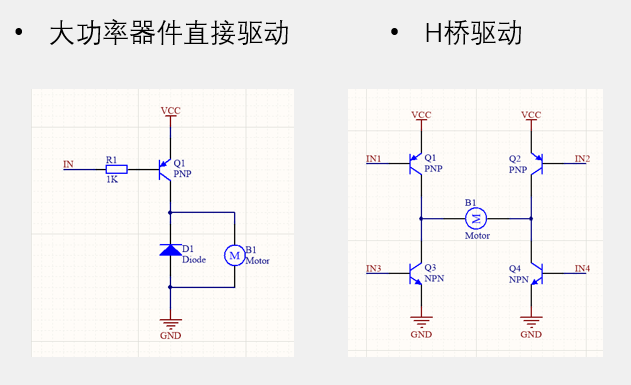
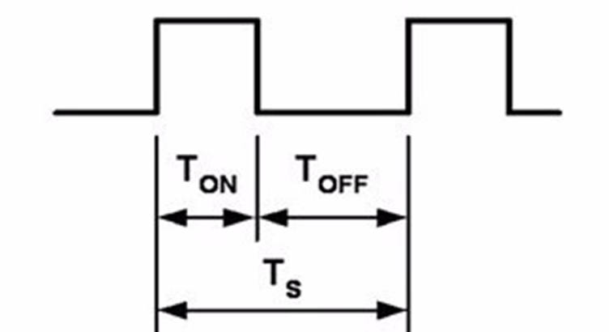
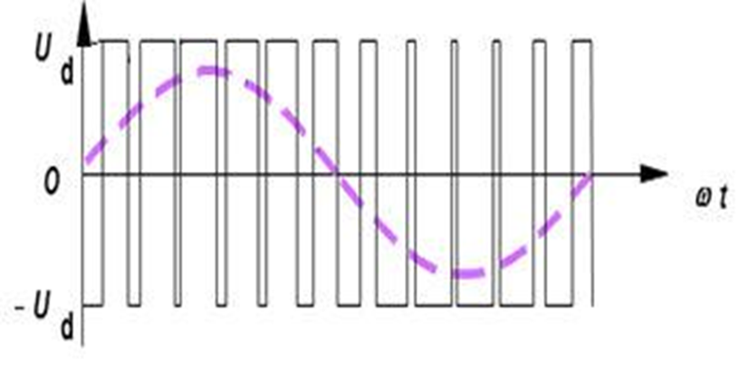
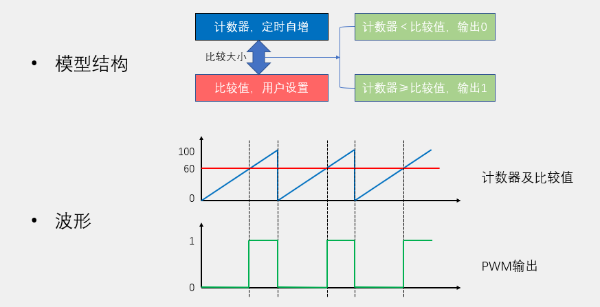

## 直流电机
- 直流电机是一种将电能转换为机械能的装置。一般的直流电机有两个电极，当电极正接时，电机正转，当电极反接时，电机反转
- 直流电机主要由永磁体（定子）、线圈（转子）和换向器组成
- 除直流电机外，常见的电机还有步进电机、舵机（机械臂）、无刷电机、空心杯电机（无人机）等

### ULN2003D

### 电机驱动电路

#### 大功率器件直接驱动
**常见做法**：用一个功率三极管（NPN/PNP）、MOSFET 或达林顿管，直接作为开关控制电机。
**特点**
- 电路简单：只需要一个功率开关管和续流二极管。
- 驱动方式单一：只能实现电机 单向转动 或 开/关控制。
- 续流回路要求：由于电机是感性负载，必须并联续流二极管以保护功率管。
- 适用场景：风扇、电动水泵、简易转动机构等只需单向转动的场合。
**优点**
成本低，易于实现。
驱动效率高（MOSFET导通内阻小）。
**缺点**
**不能反转，只能实现开/关**。

#### H桥驱动
由 4 个功率器件（MOSFET/三极管）组成“H”字形电路，电机接在横杆中间。
**特点**
双向驱动：可通过控制对角线两管导通实现电机正转/反转。
能量回馈/快速制动：可实现电机短路制动或能量回馈（高端 H 桥 + PWM 控制）。
PWM 调速：可以用高低桥组合实现调速。
逻辑控制复杂：需要防止上下桥臂直通（shoot-through）。
**优点**
功能全面：**正转、反转、调速、制动**。
广泛应用于机器人、自动门、四驱小车等。
**缺点**
电路复杂，成本高。
控制信号需要 **死区时间** 避免上下管直通。

#### 对比
| 特性    | 大功率器件直接驱动       | H 桥驱动             |
| ----- | --------------- | ----------------- |
| 电路复杂度 | 简单，一个管子就够       | 复杂，至少 4 个管子       |
| 转动方向  | 单向              | 可正反转              |
| 控制方式  | 开/关控制，简单 PWM 调速 | 正反转 + PWM 调速 + 制动 |
| 成本    | 低               | 较高                |
| 适用场景  | 风扇、水泵、单向电机      | 机器人、电动车、双向控制系统    |

如果只需要电机单向转动，直接用一个功率管就行。
如果需要正反转和调速功能，就必须用 H 桥驱动。

### 电机调速（PWM）
1. **PWM（Pulse Width Modulation）即脉冲宽度调制**，在具有惯性的系统中，可以通过对一系列脉冲的宽度进行调制，来等效地获得所需要的模拟参量，常应用于电机控速、开关电源等领域
2. **PWM重要参数：**
- 频率 = 1 / TS            
- 占空比 = TON / TS           
- 精度 = 占空比变化步距
一般保证一个周期一样宽

3. **产生PWM信号方法**
