## AD/DA转换
- **AD（Analog to Digital）**：模拟-数字转换，将模拟信号转换为计算机可操作的数字信号
- **DA（Digital to Analog）**：数字-模拟转换，将计算机输出的数字信号转换为模拟信号
- AD/DA转换打开了计算机与模拟信号的大门，极大的提高了计算机系统的应用范围，也为模拟信号数字化处理提供了可能

**常见模拟器件**：
- 光敏电阻
- 热敏电阻
- 麦克风
- 扬声器
- LED
- 电机
- 舵机
- 电位器
- 滑动开关
- 按钮
- 旋钮
- 加速度计
- 陀螺仪
- 磁力计
- 各种传感器

### 系统工作流程可以概括为
**51单片机** → (通过SPI发送控制字) → XPT2046 → (采集指定通道的模拟电压并转换为数字量) → (通过SPI输出结果) → **51单片机** → (处理数据并转换为实际物理量) → (通过并口/I2C/SPI发送指令和数据) → LCD显示屏

### 硬件电路模型
**数字量与模拟量成正比关系**
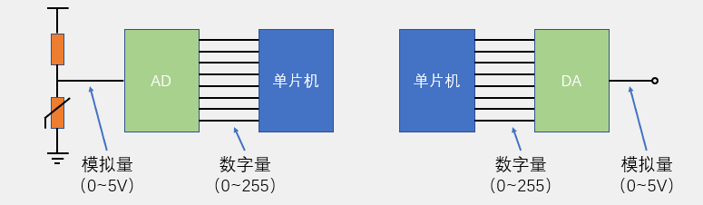
- **AD转换通常有多个输入通道**，用多路选择开关连接至AD转换器，以**实现AD多路复用**的目的，提高硬件利用率
- AD/DA与单片机数据传送可使用**并口**（速度快、原理简单），也可使用串口（按位发送、接线少、使用方便）
- 可将AD/DA模块直接集成在单片机内，这样直接写入/读出寄存器就可进行AD/DA转换，单片机的IO口可直接复用为AD/DA的通道


### 硬件电路
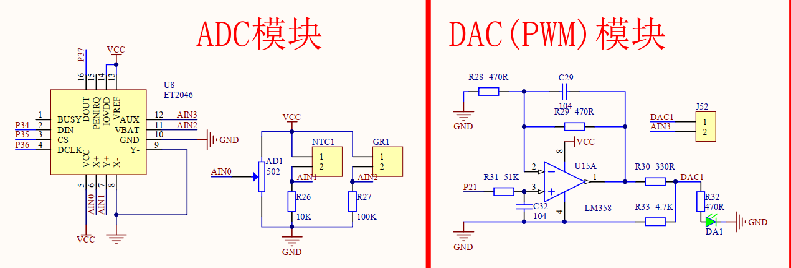
这里的AD模块可以接触摸屏，也可以接其他传感器，数据通信总线是SPI（串行通信）

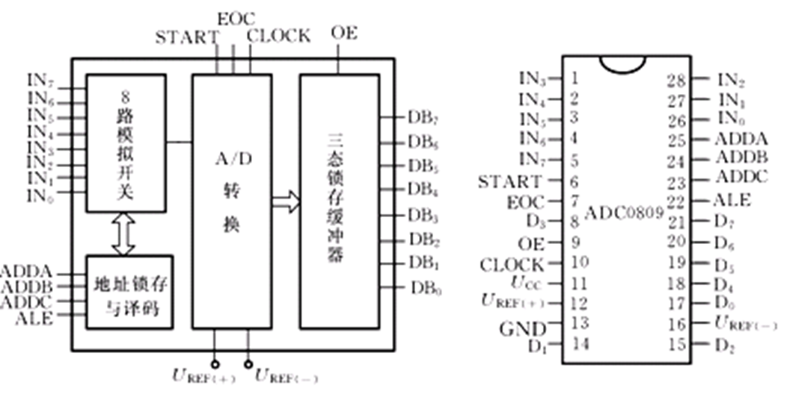
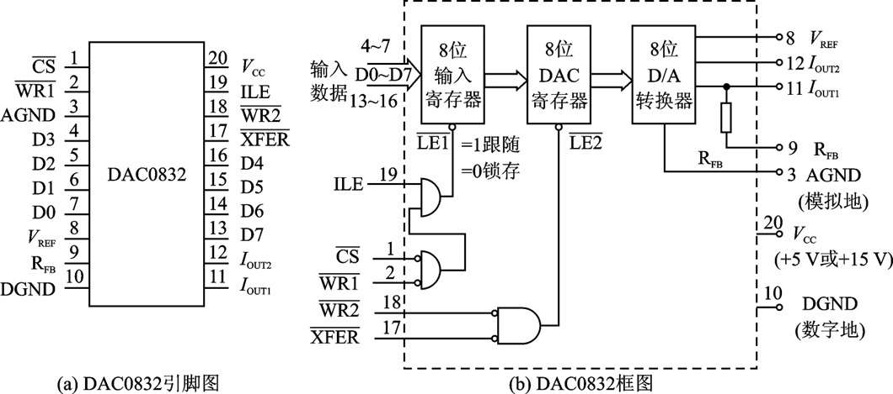

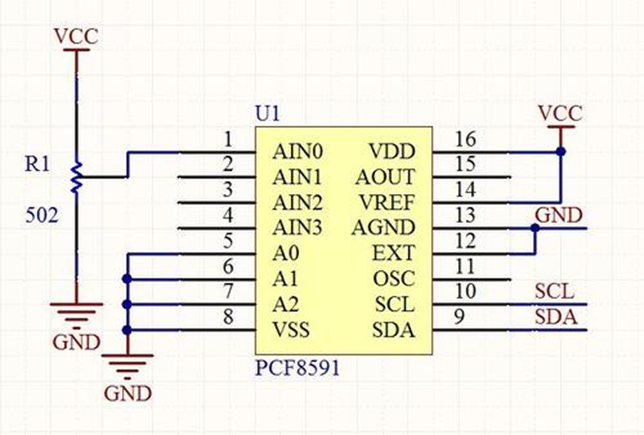
此芯片是I2C 的AD/DA转换芯片，包括4路ADC和1路DAC


### 运算放大器
- 运算放大器（简称“运放”）是具有很高放大倍数的放大电路单元（集成电路单元）。内部集成了**差分放大器**、**电压放大器**、**功率放大器**三级放大电路，是一个性能完备、功能强大的通用放大电路单元，由于其应用十分广泛，现已作为基本的电路元件出现在电路图中
- 运算放大器可构成的电路有：电压比较器、反相放大器、同相放大器、电压跟随器、加法器、积分器、微分器等
- 运算放大器电路的分析方法：虚短、虚断（负反馈条件下）

**这部分需要学习模电知识**

#### 运放电路
1. 电压比较器
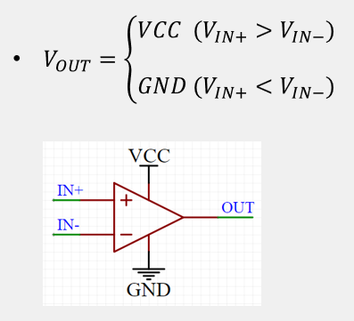
放大倍数A无穷大，利用电压差值进行放大，V = A * (Vin+ - V2in-)，差值为正，放大为VCC，差值为负，放大后为GND
2. 反向放大器
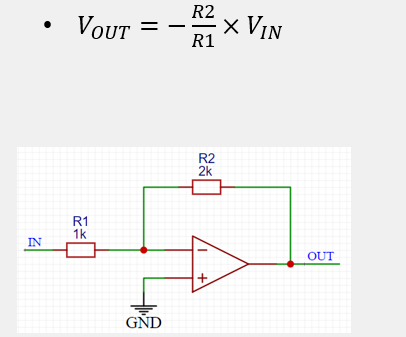
可调放大倍数的反向放大器，反馈情况下的放大倍数为-R2/R1
形成虚短，电路负反馈状态，负极电压和正极电压相等
3. 同向放大器
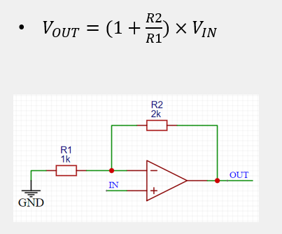
4. 电压跟随器
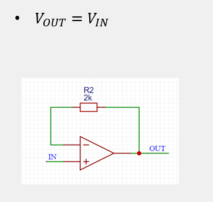
相当于提升了电流，电流强了，驱动能力变强


### DA原理

1. **T型电阻网络DA转换器**
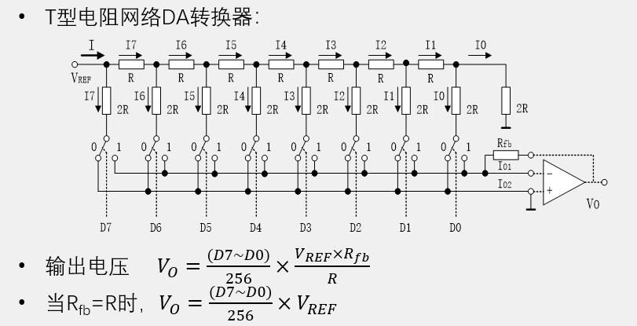
- 右侧存在负反馈电路，使用虚短和虚断分析
- 如图，由于负反馈电路存在，I01和I02无论上部电路接1还是0，都相当于接在GND上
- **反向放大器，公式里面需要加负号**
- 提高精度需要改变T型电阻网络的结构

1. **PWM型DA转换器**
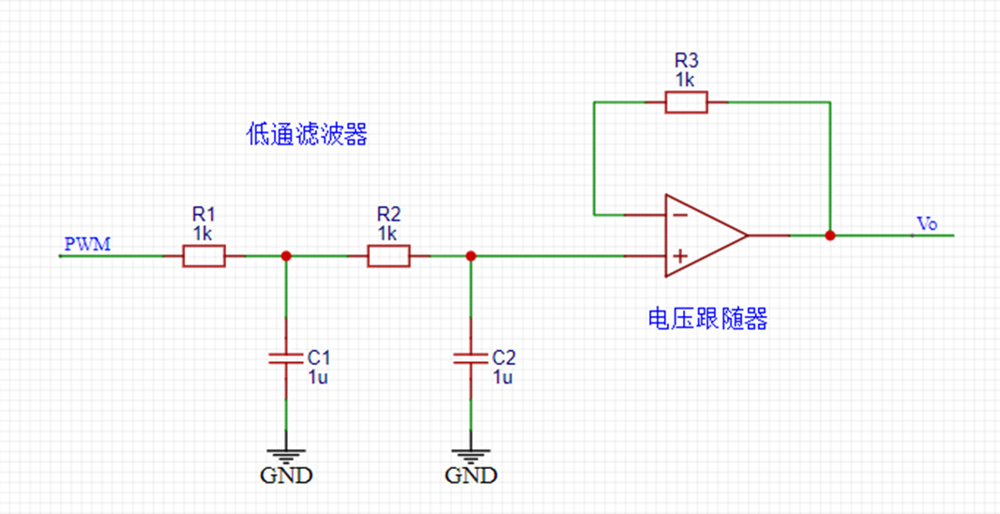
**输出电压     ?_?=(PWM占空比)×?_?**
- 图中存在RC滤波器，C接地为低通滤波器，R接地为高通滤波器，存在两组为二阶滤波器，滤波效果更好
- 低通滤波，用信号与系统的知识来看就是去除了高频信号，剩下直流信号
- 提高占空比精度即可，即可提高输出电压精度


### AD原理

逐次逼近型AD转换器：
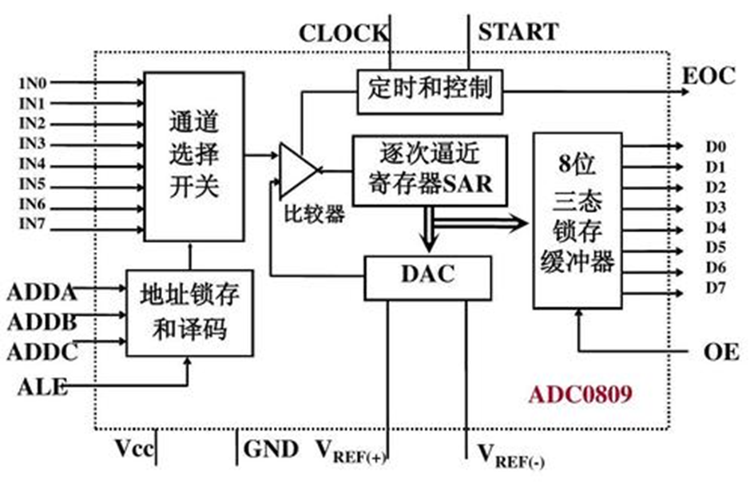
**输出数字量    (?7~?0)=V?? / V??? ×256 …… 结果取整**
- 输入的是未知电压，通过内部DAC输出一个电压和未知电压进行比较，不相同就逐渐逼近，直到未知与已知接近相同，可以用已知表示未知
- 二分法/二分查找逼近来理解


### AD/DA性能指标

**分辨率**：指AD/DA数字量的精细程度，通常用位数表示。例如，对于5V电源系统来说，8位的AD可将5V等分为256份，即数字量变化最小一个单位时，模拟量变化5V/256=0.01953125V，所以，8位AD的电压分辨率为0.01953125V，AD/DA的位数越高，分辨率就越高，（变化图像逐渐趋近平滑）
**转换速度**：表示AD/DA的最大采样/建立频率，通常用转换频率或者转换时间来表示，对于采样/输出高速信号，应注意AD/DA的转换速度


### XPT2046
1. XPT2046是一款4线制电阻式触摸屏控制器,内含12位分辨率125KHz转换速率逐步逼近型A/D转换器。
   - 它采用**SPI**接口，占用四根线：CS（片选）、SCLK（时钟）、MOSI（主出从入）、MISO（主入从出）。
   - 上升沿输入，下降沿输出
2. XPT2046支持从1.5V到5.25V的低电压I/0接口。XPT2046能通过执行两次A/D转换查出被按的屏幕位置,除此之外,还可以测量加在触摸屏上的压力。
3. 内部自带2.5V参考电压,可以作为辅助输入、温度测量和电池监测之用,电池监测的电压范围可以从0V到6V。
4. 采用3线接口，采用SPI协议
5. XPT2046片内集成有一个温度传感器。在2.7V的典型工作状态下,关闭参考电压,功耗可小于0.75mW。
6. XPT2046采用微小的封装形式:TSSOP-16,**QFN-16**和VFBGA-48。
7. 工作温度范围为-40℃~+85℃。与ADS7846、TSC2046、AK4182A完全兼容


#### XPT2046 引脚功能说明
| 引脚名称 | 类型 | 说明 |
|----------|------|------|
| **X+ (XP)**  | 模拟输入 | 触摸屏 X 轴正端，接触摸屏玻璃的 X+ 电极 |
| **X- (XM)**  | 模拟输入 | 触摸屏 X 轴负端，接触摸屏玻璃的 X- 电极 |
| **Y+ (YP)**  | 模拟输入 | 触摸屏 Y 轴正端，接触摸屏玻璃的 Y+ 电极 |
| **Y- (YM)**  | 模拟输入 | 触摸屏 Y 轴负端，接触摸屏玻璃的 Y- 电极 |
| **DIN**      | 数字输入 | SPI 数据输入 (MOSI)，接收控制命令 |
| **CS**      | 数字输入 | 片选信号，低电平有效 |
| **DCLK**    | 数字输入 | 外部SPI 时钟 (SCLK)信号输入，上升沿/下降沿采样数据 |
| **DOUT**    | 数字输出 | SPI 数据输出 (MISO)，ADC 转换结果输出 |
| PENIRQ   | 数字输出 | 触摸检测中断引脚，低电平表示触摸按下 |
| VCC      | 电源 | 芯片供电，2.7V ~ 3.6V |
| GND      | 电源 | 地线 |
| **VBAT**    | 模拟电源输入 | 电池电压测量输入，可用于检测外部电池电压 |
| **AUX**     | 模拟输入 | 辅助模拟输入，扩展 ADC 测量通道 |
| VREF     | 模拟电源输入 | 参考电压输入 (典型接 VCC)，决定 ADC 精度 |
| VSSA     | 模拟地 | 模拟部分地线 |
| VDD      | 电源 | 内部逻辑供电（一般与 VCC 相连） |

**说明**
最核心的触摸功能依赖 X+/X-/Y+/Y- 四个引脚。
SPI 接口主要是 CS / DCLK / DIN / DOUT 四根线。
PENIRQ 可以减少 MCU 轮询，提高效率。
VBAT / AUX 属于扩展 ADC 功能，不一定用得到。


#### XPT2046时序图
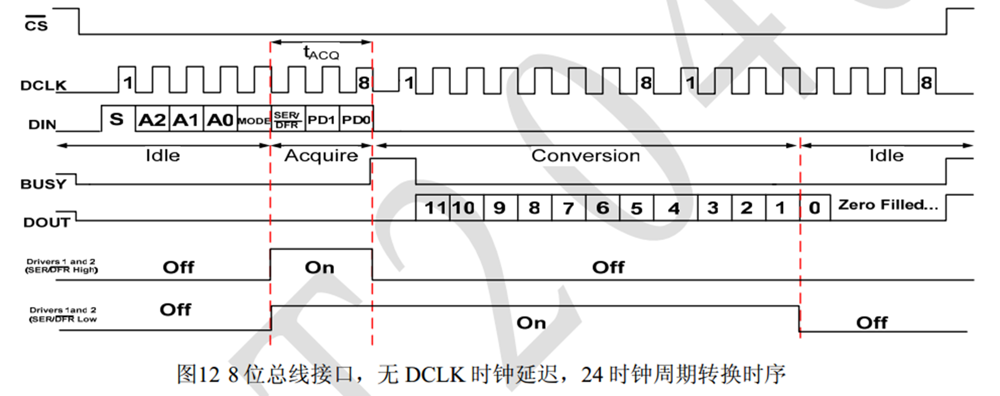

#### XPT2046 命令字格式

命令字是 8bit，具体格式如下（见 datasheet），高位在前：
```ini
S | A2 | A1 | A0 | MODE | SER/DFR | PD1 | PD0
```
**S**：起始位，固定为 1

**A2~A0**：模拟信号通道选择
000 = (X+)
001 = (Y+)
010 = (VBAT)
011 = (AUX)

**MODE**：分辨率
0 = 12bit
1 = 8bit

**SER/DFR**：模式选择
一般取 0（差分）

**PD1, PD0**：电源控制
00 = 低功耗关机
11 = 开机并保持参考

**命令字举例**
>8位模式
AIN0 (X+)：1001 0000 = 0x90
AIN1 (Y+)：1101 0000 = 0xD0
AIN2 (VBAT)：1010 0000 = 0xA0
AIN3 (AUX)：1110 0000 = 0xE0

>12位模式
AIN0 (X+)：1001 0100 = 0x94
AIN1 (Y+)：1101 0100 = 0xD4
AIN2 (VBAT)：1010 0100 = 0xA4
AIN3 (AUX)：1110 0100 = 0xE4