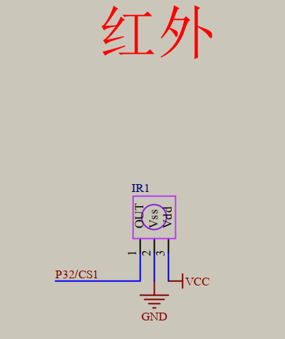
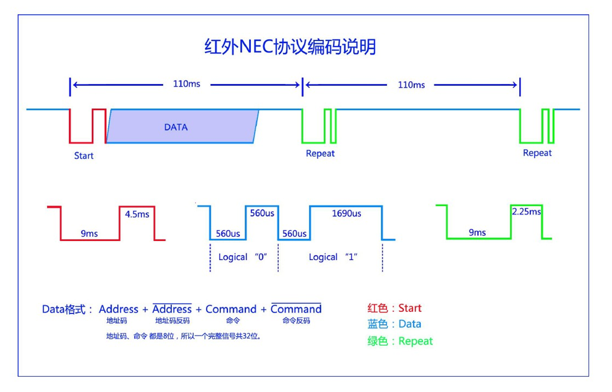
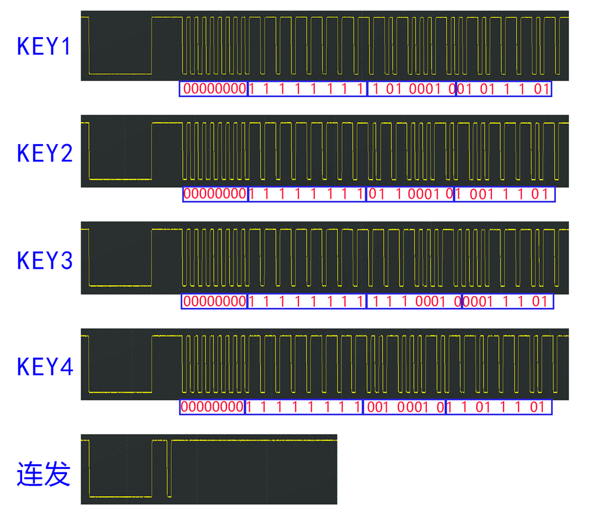
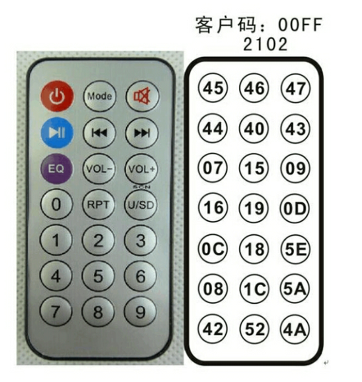
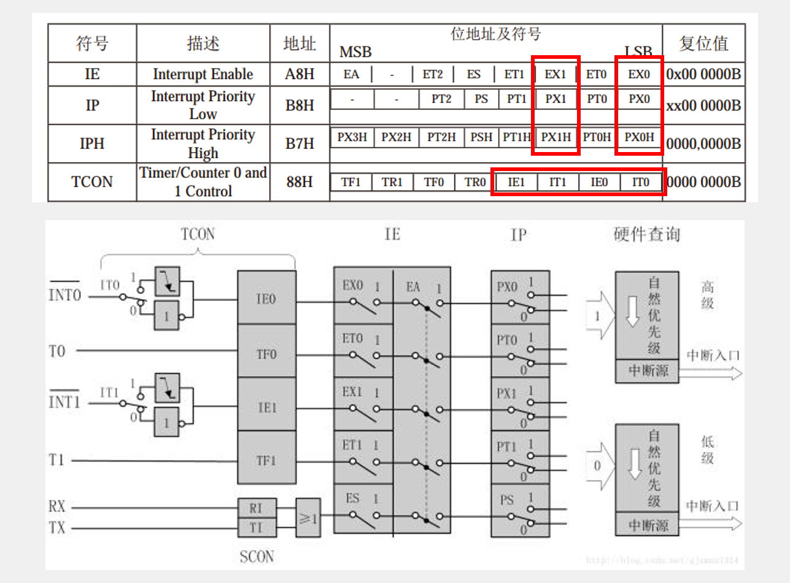

## 红外遥控
学习红外遥控的NEC编码协议，并实现单片机对红外遥控器信号的接收与解码，最终通过串口打印出按键的键值
- 红外遥控是利用红外光进行通信的设备，由红外LED将调制后的信号发出，由专用的红外接收头进行解调输出
- 通信方式：单工，异步
- 红外LED波长：940nm
- 通信协议标准：NEC标准

### 原理

**空闲状态**：红外LED不亮，接收头输出高电平
**发送低电平**：红外LED以38KHz频率闪烁发光，接收头输出低电平
**发送高电平**：红外LED不亮，接收头输出高电平

#### 红外遥控系统组成：

**发射端**： 红外遥控器。内部有编码芯片，将不同的按键信息编码成特定的格式，通过红外发射管以38KHz载波的形式发射出去。
**接收端**： 红外接收头（如HS0038）。接收红外信号，进行放大、滤波、解调后，将原始38KHz载波过滤掉，输出给单片机的就是编码好的数字信号。

#### 为什么是38KHz（载波频率）？

为了提高抗干扰能力和发射效率。环境中的可见光和热辐射（如日光灯、人体）主要是低频红外信号。使用高频载波可以极大降低这些干扰的影响，让接收头只对38KHz附近的信号敏感。

**物理层电气特性38Hz，链路层编码方法NEC协议**

#### **NEC协议格式**

一个完整的按键信号由以下几部分组成：
**Start――引导码 (Start Code)**： 一个9ms的高电平脉冲，后跟一个4.5ms的低电平。这是一个非常独特的波形，用于告诉接收头“数据开始了”，也是单片机判断一帧数据起始的依据。

**Data――用户码 (User Code) + 用户反码 (User Code Inverted)+命令码 (Command Code) + 命令反码 (Command Code Inverted)**： 共32位，User部分用于区分不同品牌的设备并用反码验证，例如电视遥控器无法控制空调。Command部分就是我们最终要获取的键值，其反码用于校验命令码是否正确。
**低位在前，高位在后**

#### **数据位表示** (0和1的定义重点区分)
位0 (Bit 0)： 560us的低电平 + 560us的高电平。
位1 (Bit 1)： 560us的低电平 + 1.68ms的高电平。
注意： 区分0和1的关键，是高电平脉冲的持续时间，而不是低电平。
**一帧数据为110ms发送完成**

**重复码 (Repeat Code)**： 当按键持续按下时，发送完一帧完整数据后，后续会每隔100ms发送一个简单的重复码（重复码9ms高电平 + 2.25ms低电平），而不是重复发送完整数据帧。

#### 红外遥控器

### 外部中断

#### STC89C52有4个外部中断
STC89C52的外部中断有两种触发方式：下降沿触发和低电平触发
- 下降沿触发： 信号稳定的场合（如红外、编码器）。首选。
- 低电平触发： 要求中断信号在中断服务函数执行期间必须一直保持低电平，否则会再次触发。容易出错，慎用。

#### 中断服务函数要“短平快”：
中断的目的是响应事件，而不是处理事件。绝对避免在中断中使用delay_ms()这类延时函数！
正确的做法是：在中断中设置一个标志位 (flag)，例如 KeyPressed = 1;，然后在主函数的 while(1) 循环中检查这个标志位，再执行相应的耗时操作。
口诀：“中断响应，主循环处理”。
硬件消抖： 如果是机械按键触发中断，建议在硬件上增加RC滤波电路（电阻电容）进行消抖，软件消抖在中断中不适用。
优先级管理： 如果系统中有多个中断，要合理安排它们的优先级，防止高优先级中断“饿死”低优先级中断。

#### 外部中断寄存器

1. 配置外部中断，主要涉及以下寄存器，必须会查数据手册并理解每一位的含义：
   - TCON - 定时器/计数器控制寄存器 (可位寻址)
   - IT0 / IT1 (TCON.0 / TCON.2)：外部中断触发方式控制位。
   - = 0：低电平触发。只要 INT0/INT1 引脚为低电平，就持续产生中断请求。
   - = 1：下降沿触发。只有当 INT0/INT1 引脚电平由高变低的瞬间，才产生一次中断请求。

2. 绝大多数场景（如按键、红外接收）都使用下降沿触发，因为低电平触发容易因为信号抖动或持续时间长导致重复触发中断。
    - IE0 / IE1 (TCON.1 / TCON.3)：外部中断请求标志位。
    - = 1：表示有外部中断请求发生了。当CPU响应中断后，硬件会自动将此位清0。
    - = 0：表示无请求。
    - IE - 中断允许寄存器 (可位寻址)
    - EA (IE.7)：总中断开关。EA = 1，CPU才允许响应所有中断。这是第一道大门。
    - EX0 / EX1 (IE.0 / IE.1)：外部中断允许位。EX0 = 1，才允许 INT0 的中断。这是第二道大门。
    - IP - 中断优先级寄存器 (可位寻址)
    - PX0 / PX1 (IP.0 / IP.1)：设置外部中断的优先级。=1为高优先级，=0为低优先级。当多个中断同时发生时，CPU先响应高优先级的。

### **操作**
**配置**： 选择引脚 (P3.2) -> 选择触发方式 (IT0=1) -> 打开中断使能 (EX0=1) -> 打开总开关 (EA=1)。
**执行**： 事件发生 -> 引脚产生下降沿 -> 硬件置位 IE0=1 -> CPU响应 -> 跳转到 interrupt 0 函数 -> 执行代码 -> 返回主程序。

### 常见问题与注意事项
1. 接收头引脚接反： 红外接收头有三个引脚（VCC, GND, OUT），接反极易烧毁，务必核对清楚。
2. 硬件连接错误： OUT线必须连接到具有外部中断功能的IO口（如P3.2或P3.3）。
3. 时序精度： 解码成功的关键在于对时间间隔的精确测量。定时器的配置要准确，判断时间范围的阈值要合理。
4. 按键抖动与重复码： 如果程序对重复码处理不当，长按一个键会收到大量重复数据。需要在程序中添加判断，如果是重复码则忽略，或者实现长按加速等功能。
5. 不同遥控器的差异： 不同品牌、型号的遥控器其用户码可能不同。拿到新遥控器，需要先用程序读取其用户码和键值，而不是直接套用教程中的值。

### 总结与应用
本节内容是单片机与外部设备通信的一个经典案例，综合运用了**外部中断**、**定时器**、**串口**三大模块。成功解码后，可以将键值应用于：
- 遥控智能小车。
- 制作遥控风扇、台灯。
- 作为其他项目的远程输入设备。