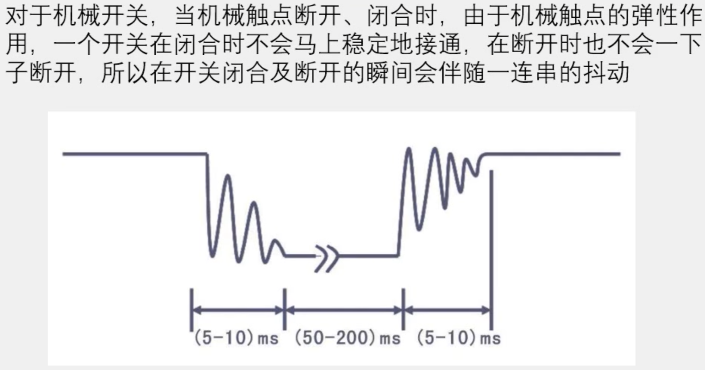
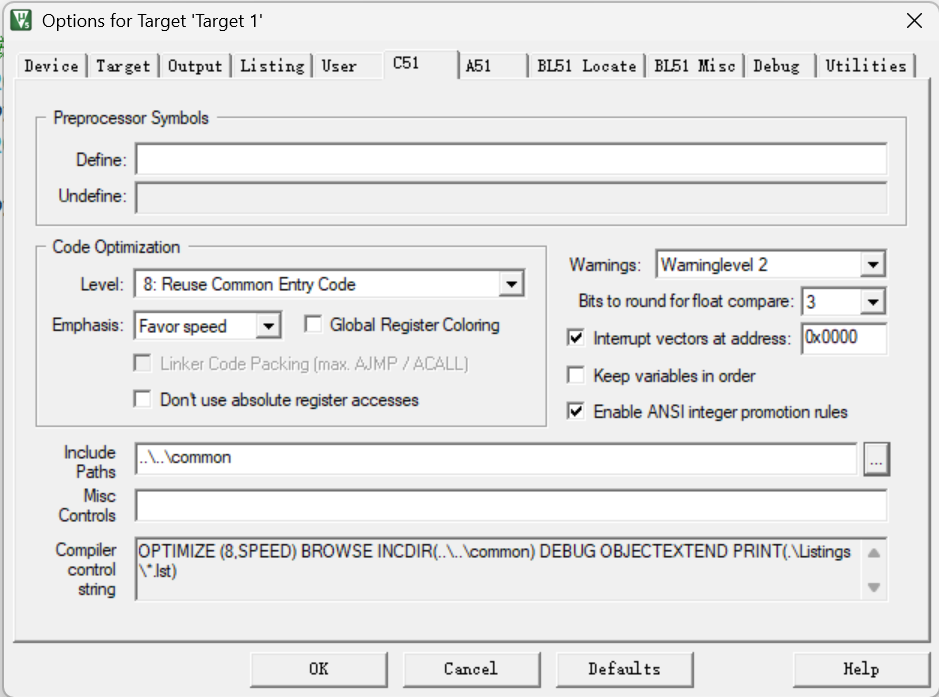
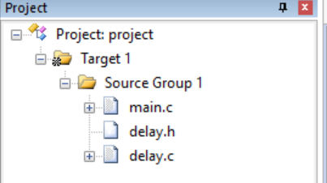
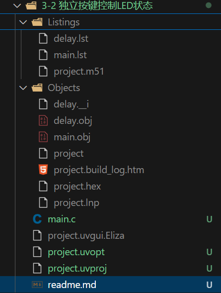

## 按钮消抖

1. 按键按下或松开时，由于机械触点的弹性作用，按键可能会出现短暂的抖动现象，这种现象会导致电路的不稳定。
2. 为了避免这种误动作，通常会使用消抖电路（debouncing circuit）来确保信号的稳定性。
3. 消抖的实现可以通过硬件（如RC滤波电路）或软件（如编程中的节流和消抖函数）来完成。

    - 按键按下时，会有一个抖动，导致按键被误判为松开
    - 按键松开时，也会有一个抖动，导致按键被误判为按下
    - 为了避免这种情况，需要在按键按下和松开时，添加一个延时，等待抖动结束
  

## 公共模块复用

### 操作步骤
1. 文件结构中`common`文件夹存放公共模块，keil需要配置`includ Path`才能拿到所有项目的公共模块代码，
2. 每个project的keil配置中，需要添加common文件夹的路径,确保项目真正拿到函数代码来运行，
3. 在`target`的文件夹上右键选择`options for target`，在`C51`选项卡中，添加`Include Path`，添加`..\common`路径

4. 将需要的文件从`common`文件夹加入目标项目。在Keil的工程窗口中，右键点击`Source Group 1`（或其他源组），选择`Add Existing Files to Group...`。
5. 在弹出的对话框中，浏览到 `common` 文件夹，选择需要添加到本项目的文件。这里选择 `delay.c` 和 `delay.h` 文件，点击“Add”添加，然后点击“Close”关闭对话框,确保相关文件的路径已经添加到项目的包含路径中。

### **注意**
添加完后可以看到项目结构中多了文件，但是并不是单纯的把文件添加到项目中，而是把文本编译成二进制文件，并添加到项目中。

#### **原理**：这个问题涉及到IDE项目管理、编译器和链接器的工作原理。
Keil的做法是保持源代码的原始位置不变，只在项目文件中记录一个引用路径。
这样做的**好处**是：多个项目可以共享同一份源代码，修改common/delay.c会同步影响所有项目，避免了重复维护。

#### 编译过程说明
Keil 的编译过程分为几个阶段，您看到的文件是不同阶段的输出：

1. 源代码（Source Code）：

- `main.c`, `delay.c`（在 `common`文件夹）这些是您编写的、人类可读的文件。
- Keil 的项目文件（`.uvproj`）只记录了这些文件的路径信息，告诉编译器：“嘿，编译的时候请去这个位置找 delay.c 文件。”

2. 编译（Compiling）：

- 当您点击编译时，Keil 的编译器会分别处理每一个 `.c` 源文件。
- 编译器会读取 `delay.c` 和 `main.c`，进行语法检查、翻译。
- 对于每个 `.c` 文件，编译器都会生成一个对应的 **目标文件（Object File）**：
`delay.c`-> `delay.obj`
`main.c` -> `main.obj`

>.obj 文件：里面是机器码（单片机可以理解的指令），但还不是完整的程序。
比如，main.obj 里有一个 调用Delay函数 的指令，但它还不知道 Delay函数 的具体代码在内存的哪个位置。

3. 链接（Linking）：

链接器（Linker）的角色就像一个项目经理。

- 它把所有的 `.obj` 文件（`main.obj`, `delay.obj`）以及启动代码、库文件等“**捏合**”在一起。
- 它的**主要工作是解决地址问题**：它找到 `delay.obj` 中的 `Delay函数` 的实际代码
- 然后告诉 `main.obj`：“你要找的 Delay函数 在这里，地址是 XXXX”。

最终，链接器生成一个完整的、可以烧录到单片机里的文件：
`.hex` 或 `.bin` 文件：这就是**最终的可执行文件**，您通过烧录软件将它下载到单片机中。您的项目里生成了 project.hex。

4. 其他文件：

- `.lst `（List File）：列表文件。它是编译器生成的“学习报告”，里面同时包含了您的原始C语言代码和编译器翻译后的汇编指令，用于高级调试。
- `.m51` （Map File）：映射文件。它是链接器生成的“项目总结报告”，详细列出了所有函数、变量在单片机内存中的具体地址、程序占用了多少空间等，对于优化和深度调试非常重要。
- `project.build_log.htm`：编译日志的网页文件，记录了本次编译的详细过程和信息。

>用一个比喻来理解
您的 common 文件夹：就像一个中央图书馆。delay.c 是图书馆里的一本书。
您的 Keil 项目（2-2 LED闪烁 文件夹）：就像你个人的书桌。
“Add Files to Group...”：就像是去图书馆的目录系统里登记一下，说：“我写论文需要参考图书馆里的这本书。”（只是在你的项目计划里记了一笔，并没有把书从图书馆搬到你桌上）
编译过程：就像你根据参考书和自己的写作，生成了一堆论文草稿（.obj）和笔记（.lst）。
链接过程：就像你最后把所有草稿和引用整合在一起，生成最终的论文（.hex）。

**优点**
节省空间：多个项目（如 2-1, 2-2, 3-1）可以共享同一份 delay.c 和 delay.h，而无需在每个项目里都复制一份。修改 common/delay.c，所有项目都会生效。
易于维护：如果你要修改延时函数，只需要修改 common 目录下的一个文件，所有引用了它的项目在下次编译时都会自动使用最新的版本。
结构清晰：将公共代码和项目特定代码分开，使项目结构更干净、更专业。