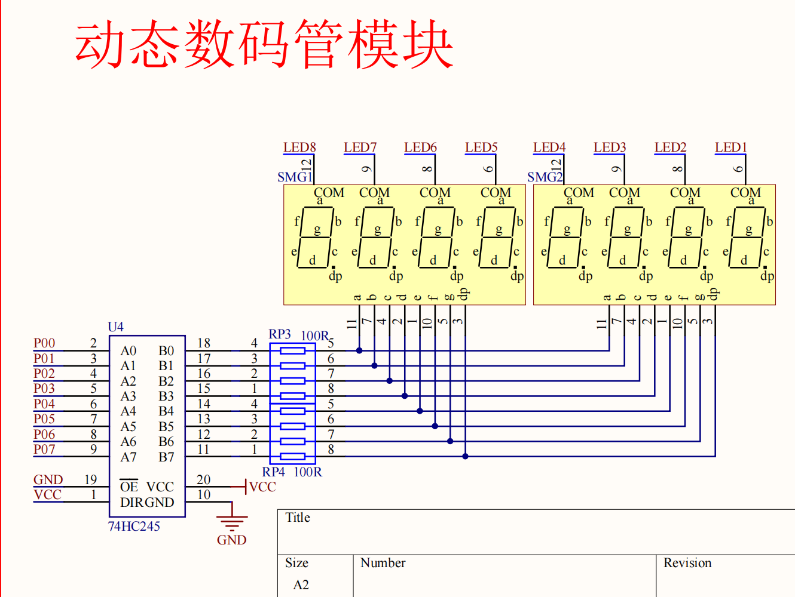
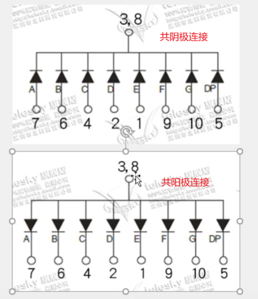
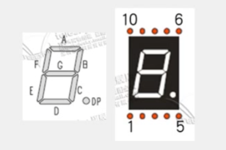
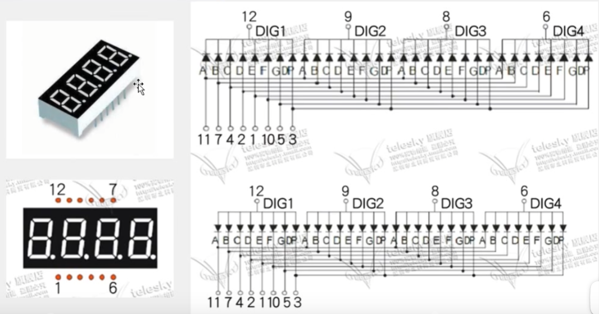
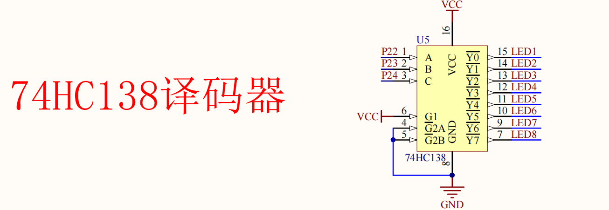

# 实验4 静态数码管显示

1. 数码管由多个发光二极管封装在一起组成“8”字型的器件，本质上是显示器
2. 每个发光二级管由两个管脚组成，一个管脚为阳极，一个管脚为阴极。

## 实验原理图

### 单个数码管

通过**段码**控制数码管显示
- 共阴极接GND
- 共阳极接VCC

### 单个数码管引脚序号
引脚就近引出

### 多位一体数码管

如图，四位一体，公用引脚，节省引脚占用。
1. **控制方法**
   - 位选：选择要显示的数码管，共阴极连接，给0选中（共阳极连接，给1选中）    
   - 段选：选择要显示的数字，共阴极连接，给1阳码显示（共阳极连接，给0阴码显示）

2. **只能在一个时间点亮一个数码管，或者点亮的几个数码管显示相同的数字。**
>如，同时给DIG1和DIG2上电，导致DIG1和DIG2同时显示相同的数字的情况

3. **动态扫描显示**
   - 利用肉眼滞留，通过高速切换位选，达到多个数码管同时显示不同数字的效果
   - 需要使用定时器中断
   - 扫描频率一般在50Hz以上，避免肉眼看到闪烁
   - 扫描频率过高会导致数码管亮度变暗
   - 扫描频率过低会导致数码管闪烁
>这里使用的是单片机扫描，会占用大量cpu运行时间，可以使用74HC595在单片机扫描基础上减少IO口，,或者专用驱动芯片完成如TM1640。

## 补充
### 138译码器 控制位选
用2^3=8来选择8个数码管，此操作可控制位选

此处**原理图取非，将序号与二进制对应起来，方便理解**，本来默认低电平有效，取非后高电平有效

>如LED5亮，按照低电平有效那么Y4为010，与常识不一致。那么Y4取反为101，与原理图序号一致，也方便理解

### 74HC245双向数据缓冲器  控制段选
用于数据的输入和输出
共阴极连接，给1阳码显示；共阳极连接，给0阴码显示
**小端排列：dp,g,f,e,d,c,b,a**
>共阴极连接,如要显示数字1，那么段选数据为0000 0110，对应二进制为0x06

## 实验步骤
1. 通过138译码器选择要显示的数码管
2. 通过74HC245双向数据缓冲器输入段选数据
3. 若扩展到动态数码管，需要消影

