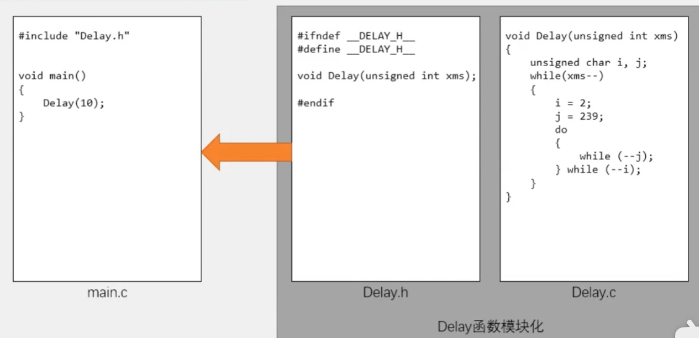
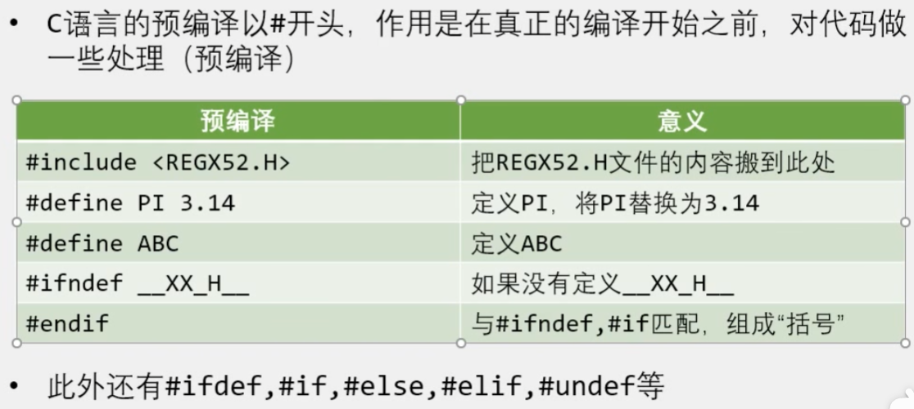
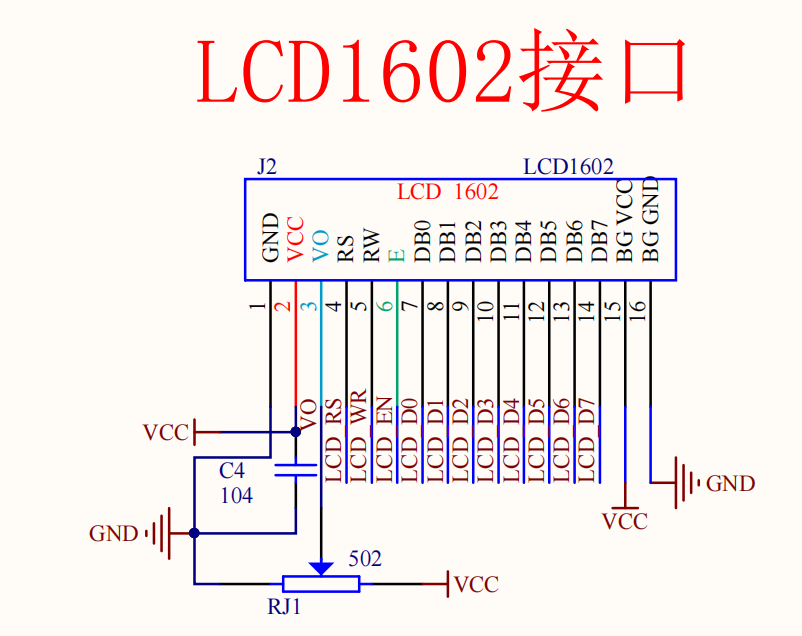
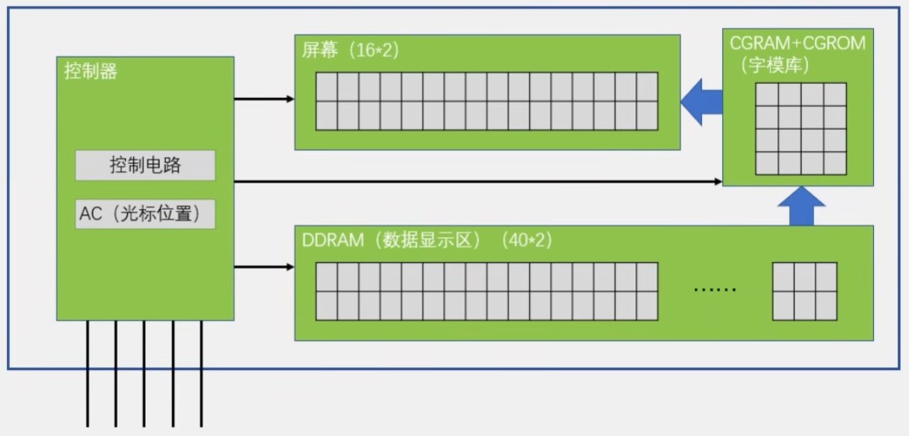
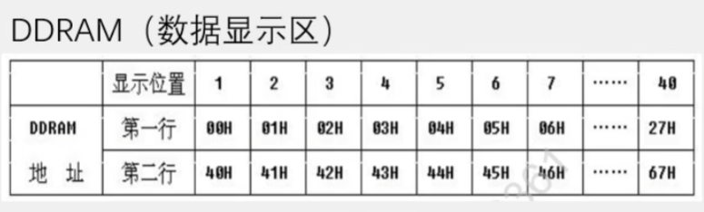
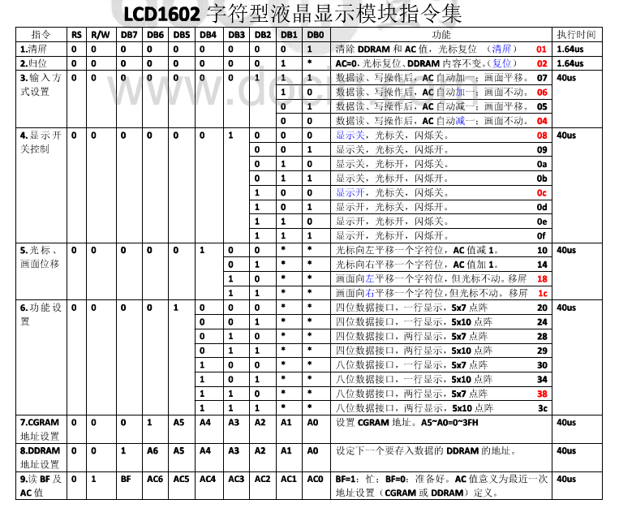
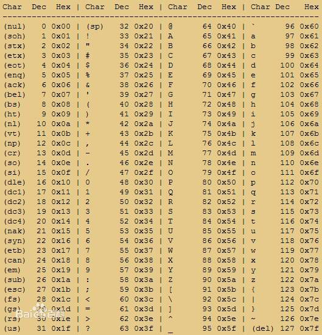
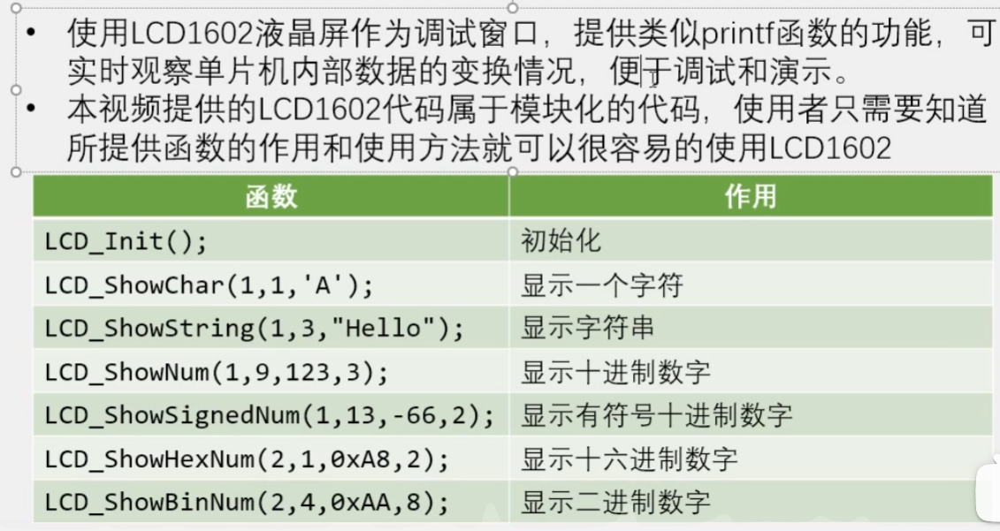

## 模块化编程
在[README.md](README.md)中，有模块化编程的一些软件操作方法，将程序分成多个模块，主要是说明了delay函数在common文件夹的引用方法。

### 模块化编程框图


### 模块化注意
1. .c文件:函数、变量的定义
2. .h文件:可被外部调用的函数、变量的声明

   - 任何自定义的变量、函数在调用前必须有定义或声明(同一个.c)
   - 使用到的自定义函数的.c文件必须添加到工程参与编译
   - 使用到的.h文件必须要放在编译器可寻找到的地方(工程文件夹根目录、安装目录、自定义)

3. **C语言预编译**
   

   **对程序某些部分是否预编译进行选择**
   ```c
    #ifndef __AT89X52_H__  //判断是否定义过
    #define __AT89X52_H__  //如果没有定义过，就定义
    //对应C文件的函数声明
    ……
    #endif                 //定义结束
   ```
>这里将之前数码管模块化到common文件夹中

## LCD1602模块
LCD1602(**Liquid Crystal Display**)液晶显示屏是一种字符型液晶显
示模块,可以显示ASCII码的标准字符和其它的一些内置特殊字符,还可以有8个自定义字符
显示容量:16×2个字符,每个字符为5*7点阵

### 原理图


| 引脚 | 说明 |
| :---: | :--- |
| VSS | 地 |
| VDD | 电源正极（4.5v~5.5v） |
| VO | 对比度调节电压 |
| RS | 数据/命令选择，1为数据，0为命令 |
| RW | 读/写选择，1为读，0为写 |
| E | 使能，1为数据有效，下降沿执行命令 |
| D0~D7 | 数据输入/输出(8位并行传输) |
| A | 背光灯电源正极 |
| K | 背光灯电源负极 |
**两个数据传输类型**
1. 写指令：控制LCD怎么显示，在哪里显示
2. 写数据：控制LCD写什么

### 内部结构



1. 数据显示区可比屏幕大，但是只能显示一部分，可以用来实现滚动显示
2. 操作时可以向显示区写入数据，显示区从字模库中匹配字符，显示在屏幕上

### 相关资料
1. 指令集 
2. 字模库 
3. ASCII码表 


### 操作步骤
1. 初始化:
发送指令0x38      //八位数据接口,两行显示,5*7点阵
发送指令0x0C      //显示开,光标关,闪烁关
发送指令0x06      //数据读写操作后,光标自动加一,画面不动
发送指令0x01      //清屏

2. 显示字符:
发送指令0x80|AC   //设置光标位置
发送数据          //发送要显示的字符数据
发送数据          //发送要显示的字符数据


### 函数列表

