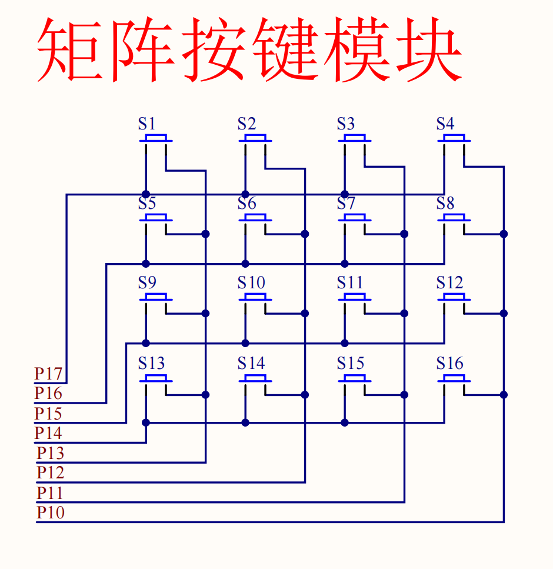

## 矩阵键盘
1. 为了减少IO口的使用，一般将按键的输入引脚连接成矩阵，这样，只需要几个IO口就可以实现多个按键的输入。
   扫描行线和列线，监测读取的IO口为 **行+列**
   若不是矩阵排列，读取一般为 **行*列**

2. 采用逐行或逐列的扫描，读出任何位置按键的状态。
   
**扫描：**
- 数码管扫描：输出扫描
   - 显示第一位 -> 显示第二位 -> 显示第三位，快速循环此过程，最终实现所有数码管同时显示的效果
- 矩阵键盘扫描：输入扫描
   - 逐行扫描：从上到下逐行读取，扫描完一行后，再扫描下一行，快速循环此过程。
   - 逐列扫描：从左到右逐列读取，扫描完一列后，再扫描下一列，快速循环此过程。
1. 矩阵键盘的按键状态为：0为按下，1为未按下。

### 原理图

**从这开始后续都是模块化编程**
**以此开始后续涉及到部分数电模电的知识，建议找课学一下**
#### tip：
在keil操作里，可以在左侧边栏`template`编辑一些固定的代码模板，提升编码效率