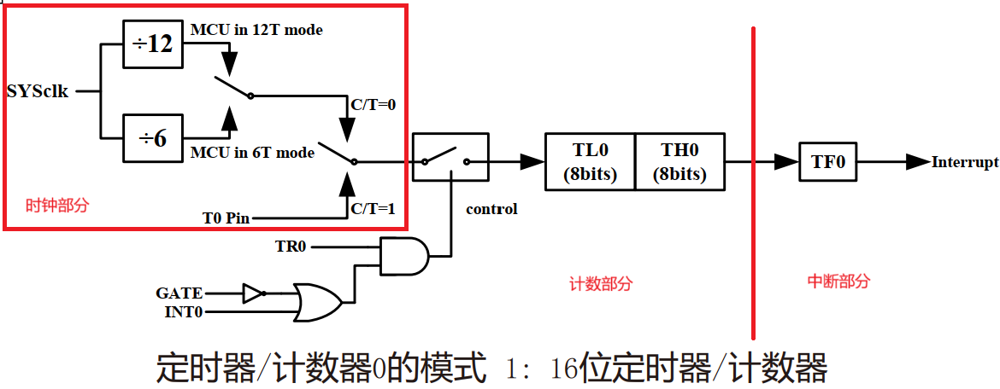
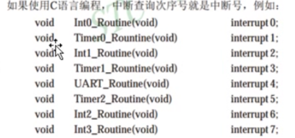
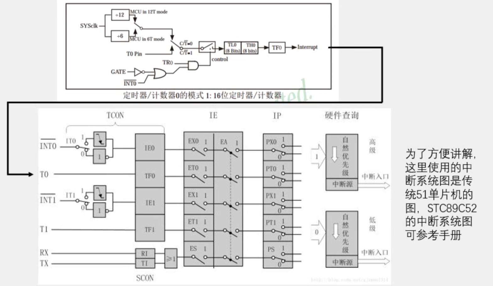
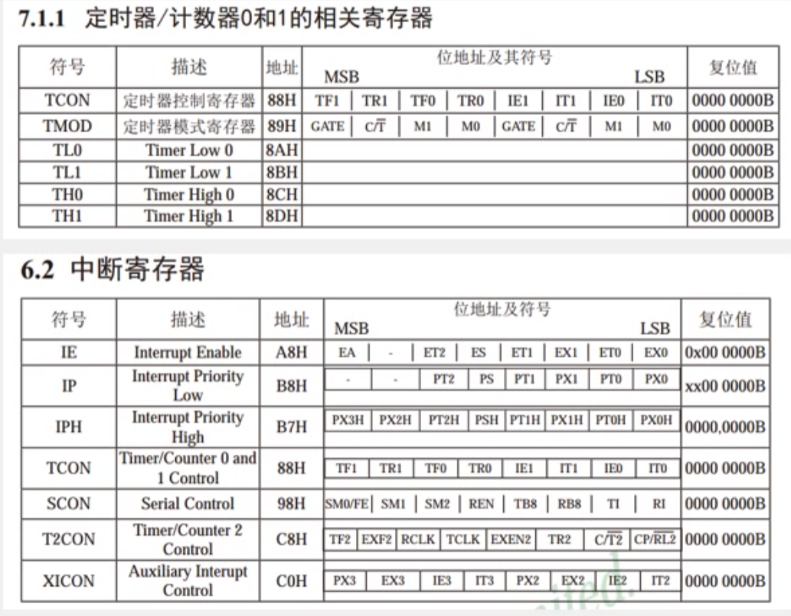

## 定时器
1. 51单片机的定时器属于单片机的内部资源,其电路的连接和运转均在单片机内部完成
2. 定时器作用:
   - **做时钟** 用于计时系统,可实现软件计时,或者使程序每隔一固定时间完成一项操作
   - **按键控制LED流水灯** 替代长时间的Delay,提高CPU的运行效率和处理速度

### STM89C52定时器资源
1. 定时器个数:3个(TO、T1、T2),TO和T1与传统的51单片机兼容,T2是此型号单片机增加的资源
**注意**:定时器的资源和单片机的型号是关联在一起的,不同的型号可能会有不同的定时器个数和操作方式,但一般来说,TO和T1的操作方式是所有51单片机所共有的

2. 定时器在单片机内部就像一个小闹钟一样,根据时钟的输出信号,每隔“一秒”,计数单元的数值就增加一,当计数单元数值增加到“设定的闹钟提醒时间”时,计数单元就会向中断系统发出中断申请,产生“响铃提醒”,使程序跳转到中断服务函数中执行

3. STC89C52的TO和T1均有四种工作模式:
    - 模式0:13位定时器/计数器
    - 模式1:16位定时器/计数器(常用)
    - 模式2:8位自动重装模式
    - 模式3:两个8位计数器

### 原理图
**T0定时器工作模式1框图**:

SYSclk:系统时钟，即晶振周期，此处单片机为11.0592MHz
   - **分频**：12T mod会把频率分频为12份  `T=1/f`

   - **$ C/{\overline{T}} $**：这里表示高电平为count计数模式，低电平为timer定时模式

## 中断
正在做某事，被更紧急事件打断，暂停此事转去处理更紧急的事情，处理完成后返回接着处理之前暂停的事情
**中断源** ―> **中断请求** ―> **中断执行** ―> **中断返回**

>会出现**中断优先级**和**中断嵌套**问题需要处理

### 中断源
1. 中断源个数:8个(外部中断0、定时器0中断、外部中断1、定时器1中断、串口中断、`外部中断2、外部中断3`)
2. 中断优先级个数:4个   
3. 中断号:
>如果使用C语言编程,中断查询次序号就是中断号,例如:

**注意**:中断的资源和单片机的型号是关联在一起的,不同的型号可
能会有不同的中断资源,例如中断源个数不同、中断优先级个数不
同等等

>不明白就把文档顺一遍

### 定时器和中断原理图

**步骤**
1. **12T mode** 时钟分频
2. $ C/{\overline{T}} $ 选择定时器模式
3. **T0pin** 控制定时器启动暂停
4. **TL0|TH0** 计数器增加到溢出产生中断信号
5. **TF0**与中断T0相连传送中断到相应优先级

**相关寄存器**
