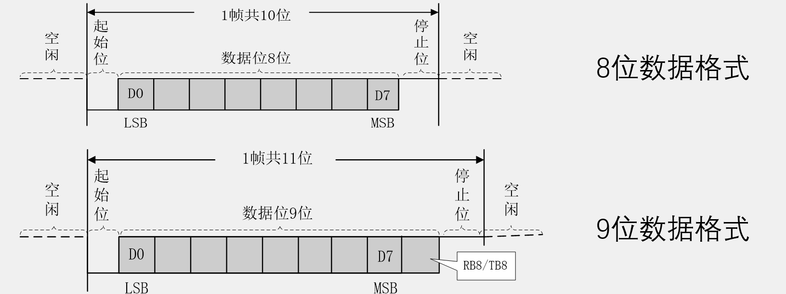
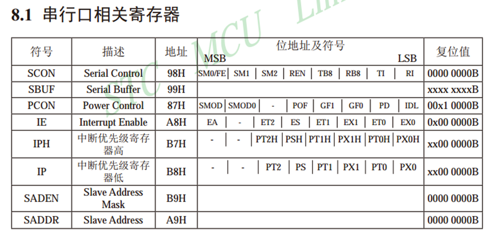
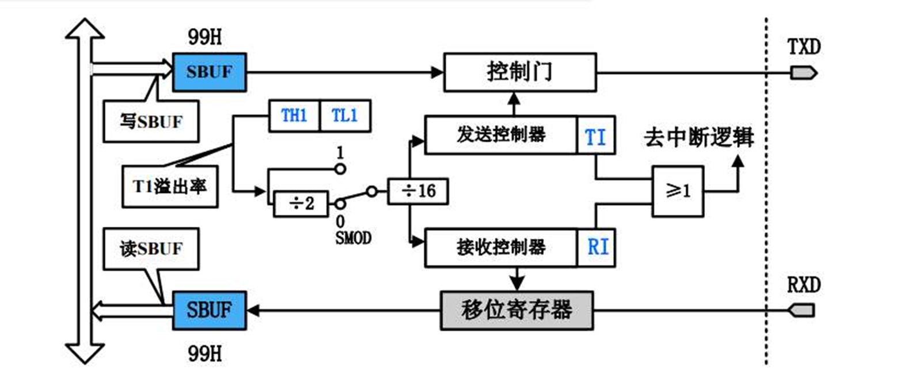
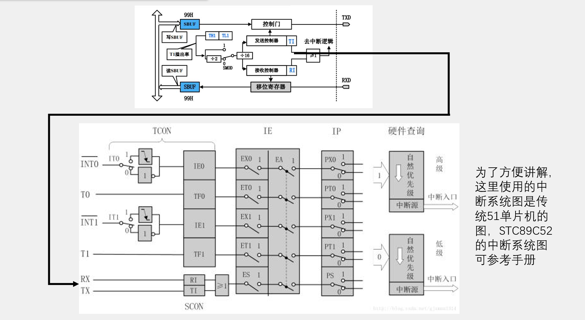

## 串口通信

### 硬件电路
1. 简单双向串口通信有两根通信线（发送端TXD和接收端RXD）
2. TXD与RXD要交叉连接
3. 当只需单向的数据传输时，可以直接一根通信线
4. 当电平标准不一致时，需要加电平转换芯片

### 51单片机的UART
1. STC89C52有1个UART
2. STC89C52的UART有四种工作模式：
   - 模式0：同步移位寄存器
   - **模式1**：8位UART，波特率可变（常用）
   - 模式2：9位UART，波特率固定
   - 模式3：9位UART，波特率可变

### 串口数据

### 串口相关寄存器

### 串口结构框图

1. **核心寄存器**
   - **SBUF（99H）**：串口缓冲寄存器
     - 写 SBUF → 数据送入发送缓冲，准备发出
     - 读 SBUF → 读取接收缓冲，得到接收到的数据
   （注意 SBUF 实际是两个寄存器，写时对应发送缓冲，读时对应接收缓冲）
   - **TI（Transmit Interrupt）**：发送中断标志
   发送一个字节完成后，硬件置位 TI。程序需清 TI，以便进行下一次发送
   - **RI（Receive Interrupt）**：接收中断标志
   接收完一个字节后，硬件置位 RI。程序需清 RI，表示数据已被处理

2. **发送部分（TXD 引脚）**

    - CPU 将要发送的数据写入 SBUF。
    - 数据进入 **发送移位寄存器**（图中上方 SBUF → 控制门 → 发送控制器）。
    - 串口根据定时器 1（TH1/TL1）产生的波特率进行逐位移出，通过 TXD 引脚发送。
    - 发送一个字节后，TI=1，若开中断则触发中断。

3. **接收部分（RXD 引脚）**

    - 外部数据通过 RXD 引脚进入。
    - 串口的 移位寄存器 接收数据并按位重组。
    - 完整的 1 个字节接收后，移入接收 SBUF。
    - 硬件置位 RI=1，若开中断则触发中断。CPU 可以读取 SBUF 取出数据。

4. **波特率发生器**

    由 定时器1（TH1/TL1） 提供。
    定时器1溢出频率经分频后，作为串口的波特率时钟。
    **SMOD 位（PCON寄存器中）控制倍频**：
    - SMOD=0 → 时钟 ÷ 16
    - SMOD=1 → 时钟 ÷ 2 ÷ 16（相当于加倍波特率）
    这样通过 TH1 装载值可灵活设定波特率。

5. **中断逻辑**

    TI 和 RI 任意一个为 1，就会送入 中断逻辑（图中 ≥1 逻辑块）。
    如果开启串口中断，则触发 CPU 进入串口中断服务程序。

6. **工作原理总结**

    **发送过程**：CPU → 写入 SBUF → 串口移位寄存器 → TXD 发出 → TI=1 → 可触发中断
    **接收过程**：RXD 接收 → 串口移位寄存器 → 数据写入 SBUF → RI=1 → 可触发中断 → CPU 读 SBUF
    **波特率控制**：由定时器1决定，TH1 设定值决定波特率，SMOD 决定倍频。

## 串口和中断

