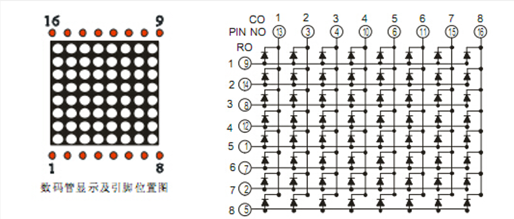
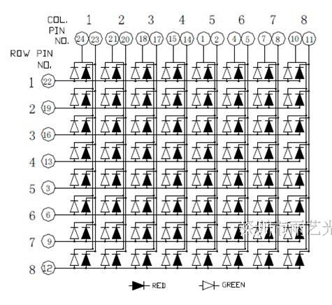
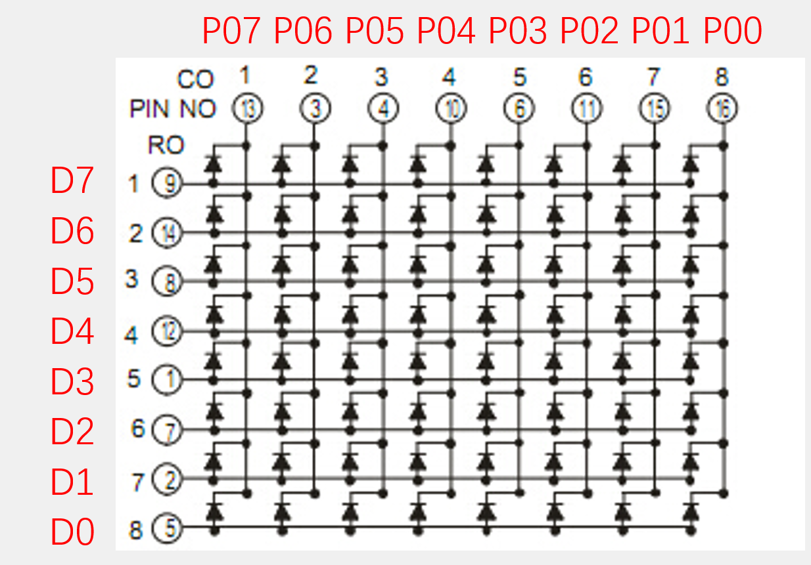
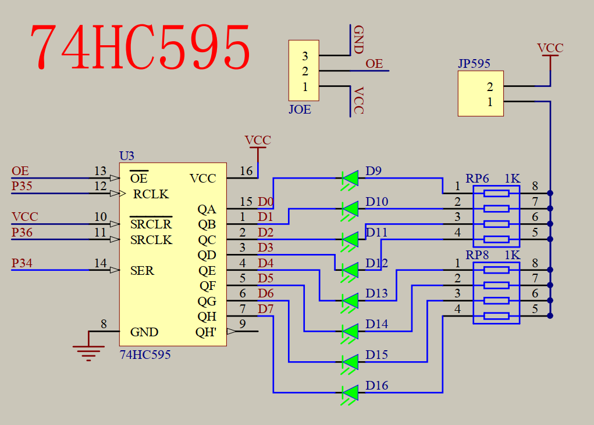
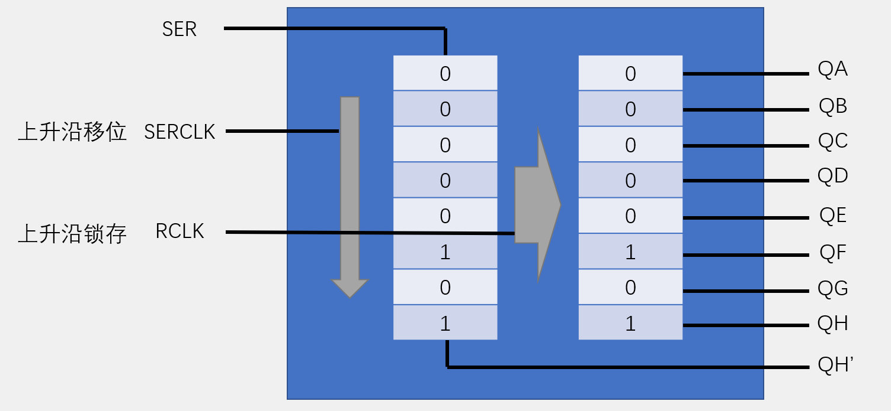

## LED点阵屏
1. LED点阵屏由若干个独立的LED组成，LED以矩阵的形式排列，以灯珠亮灭来显示文字、图片、视频等。LED点阵屏广泛应用于各种公共场合，如汽车报站器、广告屏以及公告牌等
2. LED点阵屏分类
    - 按颜色：单色、双色、全彩
    - 按像素：8*8、16*16等（大规模的LED点阵通常由很多个小点阵拼接而成）

### 硬件电路

1. 共阴接法
    - 原理：共阴接法是指将所有LED的阴极连接在一起，阳极分别连接到行线和列线。
    - 优点：简单、成本低
    - 缺点：扫描速度慢，只能显示静态图像
2. 共阳接法
    - 原理：共阳接法是指将所有LED的阳极连接在一起，阴极分别连接到行线和列线。
    - 优点：扫描速度快，可以显示动态图像
    - 缺点：成本高

### 显示原理
1. LED点阵屏的结构类似于数码管，只不过是数码管把每一列的像素以“8”字型排列而已
2. LED点阵屏与数码管一样，有共阴和共阳两种接法，不同的接法对应的电路结构不同
3. LED点阵屏需要进行逐行或逐列扫描，才能使所有LED同时显示
4.  扫描方式：
    - 逐行扫描：
      - 原理：逐行扫描是指扫描时，先将所有LED的行线拉低，再将每一行的列线拉低，以实现对每一行的扫描。
      - 优点：简单、成本低
      - 缺点：扫描速度慢，只能显示静态图像
    - 逐列扫描：
      - 原理：逐列扫描是指扫描时，先将所有LED的列线拉低，再将每一列的行线拉低，以实现对每一列的扫描。
      - 优点：扫描速度快，可以显示动态图像
      - 缺点：成本高

### 引脚对应关系

## 74HC595进行IO口扩展
74HC595是串行输入并行输出的**移位寄存器**，可用3根线输入串行数据，8根线输出并行数据，多片级联后，可输出16位、24位、32位等，常用于IO口扩展。

串行输入:一个一个输入
并行输出:一次输出多位

### 原理图

**核心信号**
1. **SER (Serial Data Input)**：串行数据输入引脚。要传输的数据以比特（bit）为单位，一位一位地从这个引脚输入。
2. **SERCLK (Shift Register Clock)**：移位寄存器时钟。在每个时钟的上升沿，移位寄存器会将SER引脚上的当前数据值移入寄存器内部。
3. **RCLK (Storage Register Clock / Latch Clock)**：存储寄存器时钟（或称锁存时钟）。在每个时钟的上升沿，移位寄存器内部已经移位好的8位数据会同时被锁存到输出锁存器中，并显示在输出引脚上。
4. **QA~QH**：并行数据输出引脚。
5. **QH'**：串行数据输出引脚。用于将多个移位寄存器级联时，将数据传递到下一个芯片的SER引脚。

**移位和锁存是独立的**：你可以在移位的过程中（RCLK保持低电平）慢慢输入数据，而输出端QA~QH保持原来的状态不变，避免在移位过程中输出端出现闪烁的中间状态。所有数据准备就绪后，再给一个RCLK上升沿，输出同时更新。
**级联**：QH' 引脚输出的是移位寄存器最高位的数据。如果需要控制超过8个的输出（如16个LED），可以将第一片的QH'连接到第二片的SER，两个芯片的SERCLK和RCLK分别并联。这样，输入16个时钟脉冲后，数据就串行移入了两个芯片，然后一个RCLK信号可以同时让两个芯片更新输出。

>这个电路的工作流程可以类比为：
**装弹（移位）**：用SERCLK像拉枪栓一样，一枪一弹（一位一bit）地把8发子弹（8位数据）依次压入弹夹（移位寄存器）。
**齐射（锁存）**：扣动扳机（RCLK上升沿），将弹夹（移位寄存器）里的所有子弹同时发射出去（更新并行输出）。
这种结构在驱动LED点阵屏、数码管、LED阵列等需要大量输出而微控制器引脚有限的应用中非常普遍。